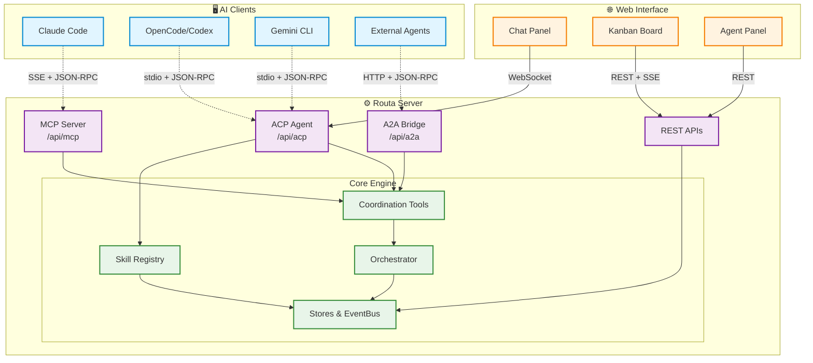

<div align="center">


# Routa

**Your AI Agent Team, Managed by Kanban**

[](https://www.typescriptlang.org/)
[](https://nextjs.org/)
[](https://github.com/tokio-rs/axum)
[](LICENSE)

[How It Works](#how-it-works) • [The Agent Team](#the-agent-team) • [Bring Your Own Agents](#bring-your-own-agents) • [Quick Start](#quick-start) • [Architecture](#architecture)

</div>

---

> **📦 Distribution Notice**
> This project primarily provides a **Tauri desktop application** (binary distribution).
> The web version is available for demo purposes only.

Project links:

- Releases: https://github.com/phodal/routa/releases
- Docs: https://phodal.github.io/routa/
- Demo Video: https://www.bilibili.com/video/BV16CwyzUED5/
- Contributing: [CONTRIBUTING.md](CONTRIBUTING.md)
- Security: [SECURITY.md](SECURITY.md)

## The Idea

Most AI coding tools give you one agent doing everything. Routa gives you a **team**.

You describe what you want in plain language. Routa's Kanban board becomes the coordination layer — breaking your intent into cards, assigning specialized agents to each column, and flowing work from Backlog → Todo → Dev → Review → Done. Each stage has a dedicated agent that knows its job and passes work forward when it's ready.

Think of it as a software team that never sleeps, where the Kanban board is both the project manager and the communication bus.


## How It Works

```
You: "Build a user auth system with login, registration, and password reset"
                              ↓
              ┌───────────────────────────────┐
              │  📋 Kanban Board (the brain)   │
              └───────────────────────────────┘
                              ↓
   Backlog          Todo          Dev           Review         Done
  ┌────────┐    ┌────────┐    ┌────────┐    ┌────────┐    ┌────────┐
  │Refiner │ →  │Orchestr│ →  │Crafter │ →  │ Guard  │ →  │Reporter│
  │  Agent │    │  Agent │    │  Agent │    │  Agent │    │  Agent │
  └────────┘    └────────┘    └────────┘    └────────┘    └────────┘
```

1. **You speak, Kanban listens** — Describe your goal in natural language. Routa decomposes it into cards on the board.
2. **Each column has a specialist** — Agents are bound to columns. When a card lands in their column, they pick it up automatically.
3. **Work flows forward** — Each agent completes its stage and moves the card to the next column. No manual handoff needed.
4. **Review before done** — The Review Guard agent checks implementation quality and can bounce cards back to Dev if needed.
5. **Full visibility** — Watch agents work in real-time. Every card shows who's working on it, what changed, and why.

## The Agent Team

Routa ships with a set of built-in specialists, each designed for a specific stage of the development workflow:

| Agent | Column | What It Does |
|-------|--------|-------------|
| **Backlog Refiner** | Backlog | Turns rough ideas into implementation-ready stories with clear scope and acceptance criteria |
| **Todo Orchestrator** | Todo | Removes ambiguity, adds execution notes, confirms the card is ready for coding |
| **Dev Crafter** | Dev | Implements the feature, runs tests, records evidence of what changed |
| **Review Guard** | Review | Inspects implementation against acceptance criteria, approves or bounces back to Dev |
| **Done Reporter** | Done | Writes a completion summary — what shipped and what was verified |
| **Blocked Resolver** | Blocked | Triages stuck cards, clarifies blockers, routes them back into the active flow |

Above the board sits the **Coordinator (Routa)** — it plans work, writes specs, delegates to specialists, and orchestrates multi-wave execution. It never writes code itself.

You can also define **Custom Specialists** with their own system prompts, model tiers, and behaviors — via the Web UI, REST API, or Markdown files in `~/.routa/specialists/`.

## Bring Your Own Agents

Routa doesn't lock you into one AI provider. Pick the backend agent that fits each task:

### ACP Providers (Agent Client Protocol)

Routa spawns and manages agent processes through ACP. Supported out of the box:

| Provider | Type | Status |
|----------|------|--------|
| **Claude Code** | CLI | ✅ Supported |
| **OpenCode** | CLI / Docker | ✅ Supported |
| **Codex** | CLI | ✅ Supported |
| **Gemini CLI** | CLI | ✅ Supported |
| **Kimi** | CLI | ✅ Supported |
| **Augment** | CLI | ✅ Supported |
| **Copilot** | CLI | ✅ Supported |

### ACP Agent Registry

Discover and install community-contributed agents from the ACP Registry — supports `npx`, `uvx`, and binary distributions. Browse the registry from Settings → Install Agents, or use the API.

### Multi-Protocol Support

| Protocol | Purpose |
|----------|---------|
| **MCP** (Model Context Protocol) | Coordination tools — task delegation, messaging, notes |
| **ACP** (Agent Client Protocol) | Spawns and manages agent processes |
| **A2A** (Agent-to-Agent Protocol) | Federation interface for cross-platform agent communication |
| **AG-UI** | Agent-generated UI protocol for rich dashboard rendering |

## More Features

- **🔧 Custom MCP Servers** — Register user-defined MCP servers (stdio/http/sse) alongside the built-in coordination server. When an ACP agent spawns, enabled custom servers are automatically merged into its MCP configuration.
- **🐙 GitHub Virtual Workspace** — Import GitHub repos as virtual workspaces for browsing and code review — no local `git clone` required. Works on serverless (Vercel) via zipball download.
- **📡 Scheduled Triggers** — Cron-based agent triggers for recurring tasks.
- **🔗 GitHub Webhooks** — Trigger agent workflows from GitHub events (push, PR, issues).
- **🧠 Memory** — Workspace-scoped memory entries that persist context across sessions.
- **📊 Traces** — Browse agent execution traces, view stats, debug agent behavior.
- **🎯 Skills System** — OpenCode-compatible skill discovery and dynamic loading from a community catalog.

## 🚀 Quick Start

### Desktop Application (Recommended)

```bash
npm install --legacy-peer-deps
npm --prefix apps/desktop install
npm run tauri:dev
```

### Web Demo (For Testing Only)

```bash
npm install --legacy-peer-deps
npm run dev
```

Visit `http://localhost:3000` to access the web interface.

### Docker

```bash
# SQLite (default, no external database required)
docker compose up --build

# PostgreSQL
docker compose --profile postgres up --build
```

### CLI (Rust)

The desktop distribution includes a `routa` CLI:

```bash
routa -p "Implement feature X"    # Full coordinator flow
routa agent list|create|status    # Agent management
routa task list|create|get        # Task management
routa chat                        # Interactive chat
```

## Community

- Bug reports and feature requests: https://github.com/phodal/routa/issues
- Security reports: [SECURITY.md](SECURITY.md)
- Contribution guide: [CONTRIBUTING.md](CONTRIBUTING.md)

## 🏗 Architecture



## 🎯 Harness Engineering in Practice

Routa is a practical case study of the three principles from [Harness Engineering](https://www.phodal.com/blog/harness-engineering/): build systems that are readable for AI, constrained by engineering guardrails, and improved through fast automated feedback.

- **System Readability** — [AGENTS.md](AGENTS.md) defines coding standards, testing strategy, and Git discipline. Specialist definitions in [`resources/specialists/`](resources/specialists/) reveal role boundaries and quality gates. Machine-friendly interfaces (MCP, ACP, A2A, REST, CLI) mean agent workflows don't depend on manual UI steps.
- **Defense Mechanisms** — `.husky/pre-commit` runs lint, `.husky/pre-push` delegates to [`scripts/smart-check.sh`](scripts/smart-check.sh). Fitness functions ([docs/fitness/README.md](docs/fitness/README.md)) define hard gates: `npm run test:run`, `cargo test --workspace`, `npm run api:check`, `npm run lint`.
- **Automated Feedback Loops** — Issue enrichment, review handoff automation, and backlog hygiene workflows ([`.github/workflows/`](.github/workflows/)) close the loop between agent output and the next iteration.

## 📄 License

This project is licensed under the MIT License — see the [LICENSE](LICENSE) file for details.

Built with [Model Context Protocol](https://modelcontextprotocol.io/) by Anthropic · [Agent Client Protocol](https://github.com/agentclientprotocol/typescript-sdk) · [A2A Protocol](https://a2aprotocol.ai/) · Inspired by [Intent](https://www.augmentcode.com/product/intent)

---

<div align="center">

**[⬆ back to top](#routa)**

Made with ❤️ by the Routa community

</div>
