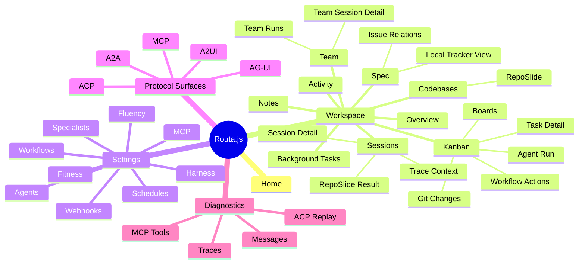
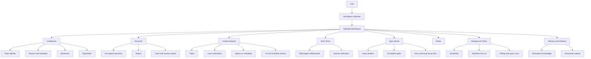
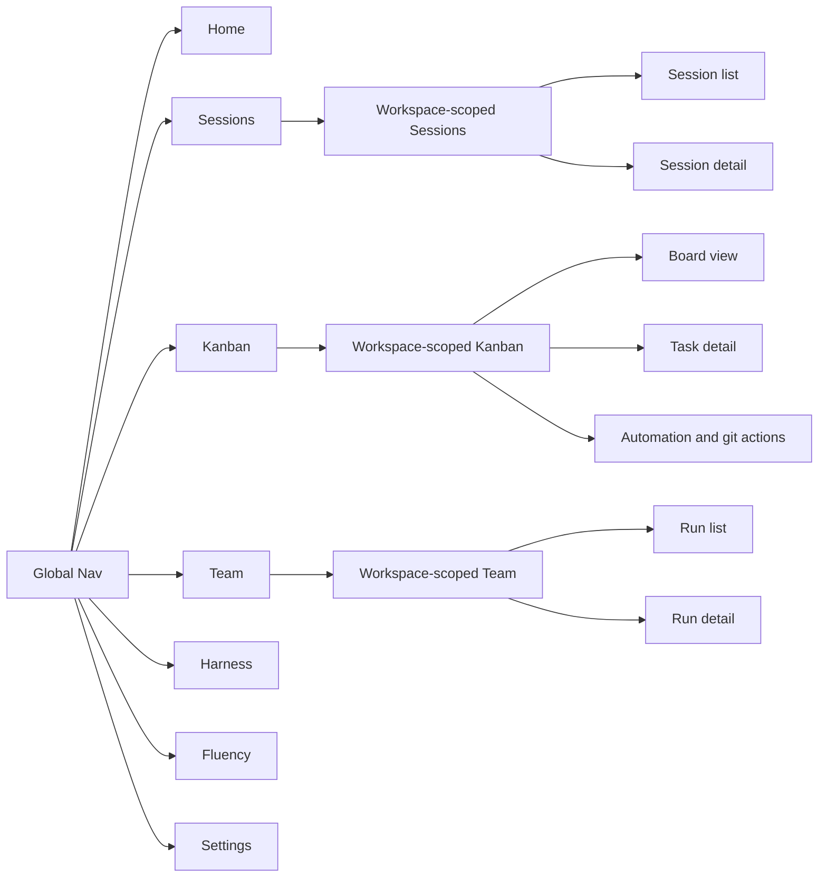
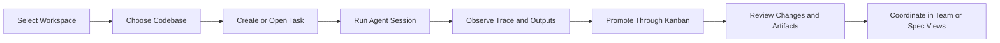

# Product IA Visualization

## Purpose

This document proposes a clear visual model for Routa.js product structure.
It is intended to make three things visible at the same time:

- what users can navigate to
- which product concepts are primary versus supporting
- how workspace-scoped coordination flows through the system

The diagrams below are aligned with the current workspace-first architecture and the generated route inventory in `docs/product-specs/FEATURE_TREE.md`.

## Design Principle

The visualization should not be a flat sitemap.
Routa.js is better explained as:

1. a workspace-first product
2. with a small set of stable navigation surfaces
3. backed by a richer coordination domain model

That means the best presentation is a layered view:

- Layer 1: navigation tree
- Layer 2: workspace information architecture
- Layer 3: key user journeys

## 1. Product Feature Tree

Use this diagram when explaining "what the product contains" at a glance.

## 2. Workspace-Centric Information Architecture

Use this diagram when explaining the product model, not just the menu.

## 3. Primary Navigation Model

This is the most useful diagram for UI and IA discussions because it separates global navigation from workspace content depth.

## 4. Key User Journey

Use this when you want to show why the workspace is the product anchor.

## Recommended Presentation

If this needs to become a single final visual for product reviews, present it in this order:

1. Product Feature Tree
2. Workspace-Centric Information Architecture
3. Key User Journey

That sequence explains:

- what exists
- how it is organized
- how users move through it

## Recommended Simplification For External Audiences

For external stakeholders, collapse the product into five top-level capability groups:

- Workspace Coordination
- Agent Execution
- Kanban Automation
- Team Collaboration
- Governance and Settings

This avoids over-indexing on protocol names and internal implementation detail.

## Notes

- Workspace should remain the primary visual anchor in all future IA diagrams.
- Codebase, session, and kanban are the three most important second-level product objects.
- Protocol surfaces such as ACP and MCP should be shown as enabling infrastructure, not peer-level user navigation.
- Some current routes still contain transitional `default` workspace behavior, but the target information architecture is explicitly workspace-scoped.
