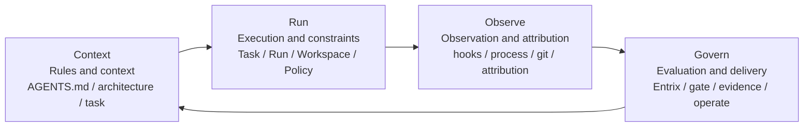
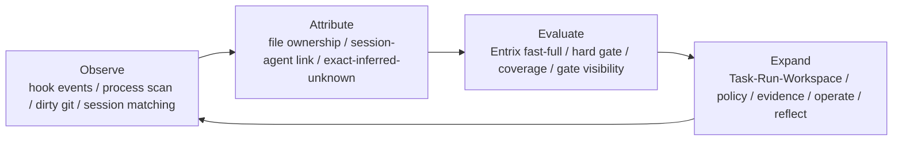

# Harness Monitor Four-Layer Model

## Review Judgment

The current semantics are directionally correct, but the concept count is too high when presented as a flat list of peer planes.

The most readable model is a four-layer loop:



In plain words:

- `Context`: decides what the agent should know
- `Run`: decides what the agent may do
- `Observe`: records what the agent actually did
- `Govern`: decides whether the result may move forward

## Stable Domain Records

This simplification does not change the stable first-class objects. Those remain:

- `Task`
- `Run`
- `Workspace`
- `EvalSnapshot`
- `PolicyDecision`
- `Evidence`
- related domain events

The loop is about how to explain behavior around those records, not about replacing them with more runtime entities.

## 3+1 Overview

For slides and overview pages, the most compact version is the implementation-biased `3+1` loop:



This is the shortest accurate story for the current codebase: `Observe -> Attribute -> Evaluate`, then expand that loop back into the full harness surface.

## Package Structure

The current package structure already fits the four-layer model without forcing a crate split per concept.

```text
Context
  AGENTS.md
  docs/ARCHITECTURE.md
  docs/fitness/README.md
  crates/harness-monitor/templates/
  crates/harness-monitor/scripts/

Run
  crates/harness-monitor/src/domain/
  crates/harness-monitor/src/application/run_assessment.rs
  crates/harness-monitor/src/operator_guardrails.rs
  crates/harness-monitor/src/repo.rs

Observe
  crates/harness-monitor/src/observe.rs
  crates/harness-monitor/src/detect.rs
  crates/harness-monitor/src/hooks.rs
  crates/harness-monitor/src/ipc.rs
  crates/harness-monitor/src/state_events.rs

Govern
  crates/harness-monitor/src/domain/evaluator.rs
  crates/harness-monitor/src/state_fitness.rs
  crates/harness-monitor/src/tui_fitness.rs
  entrix-driven gate, evidence, and readiness status consumed through run assessment

Surfaces
  crates/harness-monitor/src/main.rs
  crates/harness-monitor/src/cli_operator.rs
  crates/harness-monitor/src/state*.rs
  crates/harness-monitor/src/tui*.rs
  packages/harness-monitor/bin/harness-monitor.js
```

`Surfaces` are not a fifth semantic layer. They are entrypoints and renderers over the same four-layer loop.

## Plane Mapping

The older plane vocabulary is still useful, but it now maps into the four-layer model instead of competing with it:

- `Context` owns `Contextualize`
- `Run` owns `Orchestrate` and `Constrain`
- `Observe` owns `Observe` and `Attribute`
- `Govern` owns `Evaluate`, `Validate`, `Evidence`, and `Operate`
- `Reflect` is the feedback edge from `Govern` back into `Context`

## Code Boundary

The current shared semantic path remains:

- `RunAssessmentInput` collects raw run, workspace, and evaluation facts
- `assess_run(...)` derives operator meaning, policy and evidence state, next action, and summarized plane status
- CLI and TUI render from that shared assessment instead of reconstructing semantics independently

In concrete code:

- `crates/harness-monitor/src/application/run_assessment.rs` is the semantic aggregation layer
- `crates/harness-monitor/src/operator_guardrails.rs` remains the lower-level run/govern constraint engine
- `crates/harness-monitor/src/cli_operator.rs` and the TUI modules stay as surfaces over the same assessment path

## Scope Boundaries

This model deliberately does not claim that all four layers are equally mature.

Today the strongest implemented loop is:

- observe signals
- attribute ownership
- evaluate readiness

The remaining context, operate, and reflection capabilities should grow from that loop instead of becoming separate top-level architectures too early.

## Verification Criteria

This model is successful when:

- public docs explain `harness-monitor` with one four-layer story
- the slide-friendly `3+1` view stays consistent with the implementation
- stable domain records remain `Task / Run / Workspace / EvalSnapshot / PolicyDecision / Evidence`
- CLI and TUI still share one run assessment path
- attribution ambiguity and gate blocking remain explicit rather than hidden
