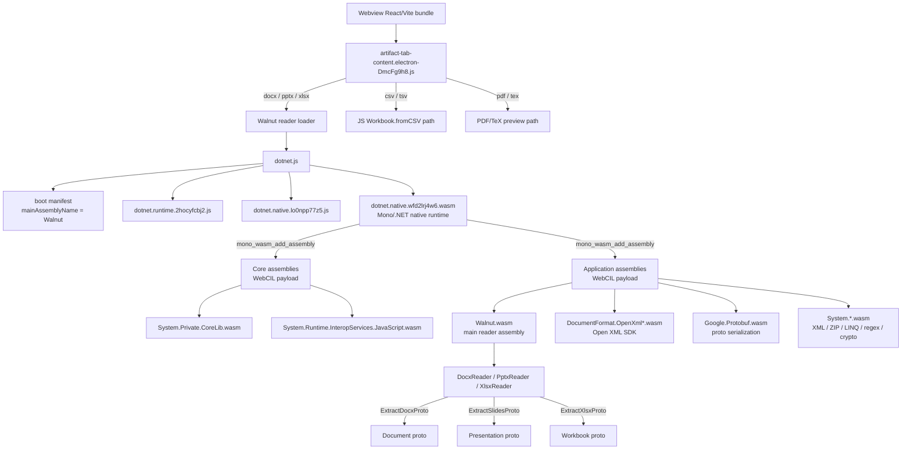

# Office Document Viewer: WASM-based DOCX/PPTX/XLSX/CSV preview

## Resolution - 2026-05-07

The parent Office viewer tracker is resolved for the current WASM reader / Office API / renderer integration scope. The child DOCX, PPTX, XLSX, Walnut workbook-layout, and XLSX viewport-performance trackers are already `resolved`; remaining unchecked items below are retained as explicit long-tail fidelity backlog rather than active blockers for exposing the Office surfaces.

PPTX was the final alignment focus in this pass. `packages/office` now emits a Cursor Canvas payload with pre-rendered slide thumbnails, and `packages/office-render` uses those image thumbnails in the left rail before falling back to the canvas renderer. This matches the expected Cursor-like rail behavior more closely than repainting every thumbnail from slide JSON at runtime.

Desktop validation used `/Users/phodal/Desktop/OrganizationalChart.pptx`. Microsoft PowerPoint opens it normally and renders slide 3/29 as the expected Thoughtworks organization chart with visible thumbnail navigation. Routa can generate a Canvas artifact for the same file, and the Cursor Canvas consistency check passes with thumbnail payload validation enabled.

Walnut/Routa PPTX checks for the same Desktop file are usable but not byte/pixel perfect. After suppressing zero crop rectangle fields, `slideShapeStyleDigestsMatch` now passes; the protocol assertion still reports `slideTextDigestsMatch` and `slideTextStyleDigestsMatch` drift from Google Slides / PowerPoint text-style materialization. Render-contract comparison now treats "both readers have no extracted speaker-note payload" as a match; remaining differences are screenshot-pixel deltas in desktop, narrow, and slideshow views, with stats matching.

## What Happened

Codex (OpenAI) 的 Electron 桌面应用内嵌了一套完整的 Office 文档预览系统，能在 side panel 中直接渲染 DOCX、PPTX、XLSX、CSV/TSV、PDF 等文件。分析 Codex app 后确认其技术栈和架构如下。

Routa 目前仅有 `file-output-viewer`（代码/搜索结果）和 `reposlide`（PPTX 下载链接），没有内嵌的 Office 文档预览能力。用户需要离开应用才能查看 agent 生成的 .docx/.xlsx/.pptx 文件。

## TODO

- [x] DOCX reader emits Walnut-like `oaiproto.coworker.docx.Document` and passes protocol equivalence for `dll_viewer_solution_test_document.docx`.
- [x] DOCX advanced protocol fields: headers/footers, comments, footnotes/endnotes, basic track changes, hyperlinks, content-control text, floating/anchored images, chart references, paragraph numbering, and table color parity.
- [x] DOCX bookmarks/anchor links, inline content-control placeholders, equations-as-paragraph placeholders, and no-`w:cols` section layout are covered by `docx_advanced_contract.docx` and Walnut parity checks.
- [x] DOCX debug renderer style inheritance: resolve `textStyles[].basedOn` chains so inherited paragraph/run style fields affect rendered text.
- [x] DOCX preserves Walnut-style structural empty paragraphs for body/header/footer/content-control blocks and table cells, reducing real-world element/paragraph count drift.
- [x] DOCX mirrors Walnut scalar quirks for real-world invalid OOXML: uppercase RGB/`AUTO` colors, integer-only paragraph spacing/run font size, and `contextualSpacing`-only empty paragraph fallback to docDefaults.
- [x] DOCX preserves generated table-of-contents content controls (`docPartGallery = Table of Contents`) for Word visual parity, while parity notes still document Walnut's generated-TOC skip behavior; root images remain ordered by main document relationship order parity.
- [x] DOCX resolves paragraph spacing through paragraph-style `basedOn` chains and non-`Normal` default paragraph style IDs.
- [x] DOCX mirrors Walnut root page-size and run-font quirks: root width/height only emit explicit `w:pgSz`, `image/jpeg` is preserved, and `w:rFonts` uses western font slots before East Asian slots.
- [x] DOCX table cells now emit Walnut-like borders/diagonals, gridSpan, vertical alignment, and cell IDs for real-world table parity.
- [x] DOCX paragraph mark run properties now feed paragraph text style, including `w:szCs` and `AUTO` color behavior used by Word-authored styles.
- [x] DOCX table element bbox now honors table horizontal justification against page content width.
- [x] DOCX floating image bbox now reads raw `wp:positionH/wp:positionV@relativeFrom`, applies page/margin/column/paragraph anchor frames, and preserves page-relative vertical offsets for real-world anchored images.
- [x] DOCX 1x1 sample/code-block tables now suppress implicit default-black cell-border colors like Walnut, while preserving implicit black borders for ordinary multi-cell tables.
- [x] DOCX root images now include package-level image parts beyond visible body drawings, matching Walnut behavior for numbering/bullet and orphan image parts.
- [x] DOCX long documents now raise the protocol element cap from 400 to 2,000 blocks, matching Walnut on `ebook*.docx` and `output.docx` without truncating late tables/images/text.
- [x] DOCX header/footer reference selection now reads raw `w:type` and matches Walnut default-header/footer behavior when `even/default/first` references coexist.
- [x] DOCX section page-break inference now matches Walnut on the remaining real-world single/multi-section edge cases, including generated-table-heavy docs, Heading2/Default first rendered-break documents, and multi-`sectPr` rendered page-break duplication.
- [x] DOCX root image ordering now matches Walnut for body, numbering, header/footer, and theme package images without regressing `word-sample.docx`.
- [x] DOCX revision handling now mirrors Walnut visible-text semantics: insertion marks are retained, deletion text is skipped, empty review/hyperlink/comment marker runs are not emitted, and deletion metadata remains in `reviewMarks`.
- [x] DOCX comment ranges now mirror Walnut revision-container quirks and part scoping: comment range markers inside inserted/deleted runs do not close outer active ranges, and active comment state is cleared between body, notes, and comments parts.
- [x] DOCX ignores endnotes in the Walnut-compatible `footnotes` protocol surface and ignores endnote reference-only runs.
- [x] DOCX rendered page-break text now matches Walnut's `__docxBreak:rendered__` marker for mid-paragraph `w:lastRenderedPageBreak`, while skipping leading page-render markers that Walnut omits.
- [x] DOCX section summaries now emulate Walnut page-break-derived section duplication for single-`sectPr` files, while skipping generated TOC, revision-scoped rendered page breaks, and table-internal rendered breaks.
- [x] DOCX parity tooling now treats Walnut randomized footnote/comment run IDs as unstable and compares stable reference IDs instead.
- [x] DOCX decoded Proto JSON contract now matches Walnut on the real `dll_viewer_solution_test_document.docx` fixture plus the advanced/style-section/table-style/anchor-layout contract fixtures. The comparator normalizes binary payloads and known unstable generated IDs, then asserts canonical decoded JSON equality.
- [x] DOCX corpus scanner now runs the Walnut/Routa comparer per file and can assert decoded Proto JSON contract (`scan:office-wasm-reader:docx -- --json-contract --assert`) without keeping one Walnut WASM runtime alive across a large directory.
- [x] DOCX Chinese/Word-authored style depth now emits complex-script typeface metadata from `w:rFonts/@w:cs`, paragraph mark run fonts, and numbering-level indentation fallback for list paragraphs.
- [x] DOCX real-world list/style section quirks now match Walnut decoded JSON for `06.docx`: paragraph numbering writes `autoNumberType`/`autoNumberStartAt` from numbering definitions and `w:startOverride`, paragraph styles with only alignment inherit default run font size, and empty `w:sectPr` no longer materializes synthetic page setup.
- [x] DOCX real-world table/style text quirks now match Walnut decoded JSON for `/Users/phodal/Downloads/realworld/5d1b8b8662d700110424b9ccc08ed7a1.docx`: direct table cell margins are emitted in EMU, shallow paragraph `w:firstLine` indent is preserved without over-materializing `w:hanging`, highlight values enter `textStyle.scheme`, empty/invalid table borders are suppressed, and paragraph style summaries respect `w:jc="both"` plus Walnut's default run-font inheritance boundaries.
- [x] DOCX non-Word producer decimal sizing now follows Walnut's protocol materialization for comparable files: decimal `w:ind` and decimal `w:szCs` values are not rounded into paragraph/style protocol fields, while integer default complex-script font-size inheritance is still retained for alignment-only styles without direct run fonts. This moved `/Users/phodal/Downloads/realworld/CI_CD.docx` from 98 decoded JSON diffs to `0` and `/Users/phodal/Downloads/realworld/ChocolateFactory.docx` from 1 decoded JSON diff to `0`.
- [x] DOCX debug renderer now consumes decoded section page setup, header/footer content, column settings including separator lines, paragraph alignment, margin/hanging indent, line spacing, list auto-number and bullet markers, run hyperlinks, Word underline values/styles, explicit false run emphasis overrides, DOCX highlight/caps/typeface scheme metadata, footnote/comment reference markers/bodies/metadata, insertion review marks, table bbox/widths/spans/row heights/margins/borders/diagonal borders, image/table/chart bbox offsets and sizing, and chart references.
- [x] DOCX debug renderer now uses decoded section boundaries as visual page breaks while preserving trailing root elements, and page-anchored full-width images escape page body margins to match Word cover/closing-page image layout.
- [x] DOCX debug renderer now estimates body capacity from decoded page size/margins and paginates long section/root element streams into multiple preview pages.
- [x] DOCX debug renderer now maps decoded Word font-size units into CSS pixels and uses numbering definitions for bullet/number markers when paragraph summaries do not carry direct auto-number metadata.
- [x] DOCX debug renderer now skips adjacent same-bbox tiny image placeholders, avoiding transparent Word group-object layers consuming standalone layout height.
- [x] DOCX debug renderer now inherits decoded section header/footer content across later sections that omit explicit header/footer payloads.
- [x] DOCX debug renderer now splits oversized decoded tables across preview pages, keeping long table sections from overflowing a single page body.
- [x] DOCX debug renderer now renders adjacent figure images before their captions like Word's visual order and uses compact typography/padding for table paragraphs.
- [x] DOCX renderer split regression fixed: page-overlay image pagination now imports the shared overlay classifier from `word-preview-layout.ts`, so CAG-style full-width/footer/top-logo anchored images no longer crash the debug page after file selection. Browser smoke on the CAG Schedule 8 DOCX reports `41` rendered pages, TOC leaders, and visible footer page numbers on pages 39, 40, and 41.
- [x] DOCX debug renderer now draws Word-like page crop marks at decoded page margins, matching the CAG Word print-layout pages without changing protocol extraction or body flow.
- [x] DOCX debug renderer now handles the `docx-renderer-gap-checklist.docx` Word-vs-preview drift: semicolon-delimited DOCX font stacks such as `Arial;Helvetica;sans-serif` resolve as sans fonts instead of a quoted serif fallback, Symbol private-use bullet markers normalize to Unicode bullets, and rendered pages use fixed Word-like page height instead of growing with content.
- [x] DOCX reader/debug renderer now promotes visible `w:txbxContent` drawing text into positioned page overlays and skips drawing-contained text during normal run extraction, preventing CAG-style workflow labels from leaking into body flow.
- [x] DOCX reader/debug renderer now preserves grouped picture frames as Word-like positioned background rectangles, resolves the child picture geometry from `pic:spPr/a:xfrm` instead of stretching the embedded image to the outer `wpg:wgp` frame, and skips `mc:AlternateContent` fallback drawing duplicates. This fixes the CAG Schedule 8 page 4 key-focus diagram regression introduced by the earlier full-width image work.
- [ ] DOCX visual layout depth: core protocol parity is green for the committed contract fixtures and targeted real-world Chinese samples, and the CAG reference document now matches Microsoft Word's `41` page count in Chromium with pretext-based paragraph measurement enabled. Image `a:srcRect` crop metadata now flows into the debug renderer as Word-like background sizing/positioning, `pic:spPr/a:ln` picture outlines now render as CSS borders, `a:outerShdw` picture shadows now render as CSS box shadows, `behindDoc`/foreground `relativeHeight` now drive image layer order, and positioned text box content now renders as page overlays. Remaining visual-fidelity work is full overlap precedence between multiple foreground objects, floating wrap distance, richer shape/callout fill-line/connector styling, effect metadata, broader anchored-position variants beyond the common page/margin/column/paragraph align/offset cases already covered, and richer Word-like page-flow/font metrics beyond the current bounded compensation.
- [ ] DOCX chart payload depth: chart references, cached series, series RGB fills, axis titles/gridlines, and show-value data labels now flow into the debug renderer; remaining work is richer Word-specific axis/title/legend/plot-area styling, multi-axis charts, trendlines/error bars, and embedded chart workbook/cache edge cases.
- [ ] DOCX section/header/footer long-tail: section summaries, `sections[].elements`, and leading-vs-mid-paragraph rendered page-break assignment now match the tracked-change-heavy Chinese samples. Remaining work is broader column/header/footer combinations and more non-Word producer edge cases.
- [ ] DOCX style/table long-tail: protocol-level resolution now covers docDefaults spacing/run styles, paragraph-style spacing `basedOn`, default paragraph style IDs, paragraph style summaries, renderer-side paragraph `basedOn`, direct run overrides, list auto-number type/start metadata, Word built-in `NoSpacing`/`MacroText`/`Revision*` summary defaults, alignment-only paragraph style default run fallback, explicit false bold/italic overrides, East Asian/complex-script run fonts, highlight scheme metadata, decimal-size non-materialization for comparable non-Word producer files, table cell margins, invalid/empty border suppression, image/table bbox parity for key layout cases, and table bbox from actual table width. Remaining work is latent style defaults not yet seen in fixtures, run-style materialization beyond direct properties, and richer table border/span/style regions.
- [ ] XLSX precise table styles: table headers, row/column stripe flags, first/last column emphasis, totals rows, and built-in Light/Medium/Dark style families are consumed; exact Excel built-in element definitions remain a visual long-tail item.
- [x] XLSX icon-set logic: honor `cfvo` type/value for min/max/num/percent/percentile, plus `gte`, `reverse`, `showValue`, and common icon families such as rating/arrows/traffic/symbols.
- [ ] XLSX chart fidelity: preview consumes `sheet.drawings[].chart` anchors/series/legend, major chart families, combo hints, secondary axes, trendlines/error bars, data-label flags, axis titles, legend spacing, formatted tick gutters, and family options such as bar gap/overlap plus doughnut first-slice/hole sizing; Excel/Walnut pixel-level chart auto-layout remains visual long-tail work.
- [x] XLSX drawing overlays: preview consumes chart/shape/image anchors, workbook image payloads, Walnut image references, drawing order, shadows, common shape text/line defaults, and floating hit regions. Image crop remains absent from Walnut's spreadsheet drawing schema based on the crop probe.
- [x] XLSX freeze panes / sticky headers: prefix-sum layout drives headers, visible ranges, synthetic/decoded frozen-region projection, selection segmentation, row/column resize hit testing, keyboard navigation, and edit overlay placement. Reader-side freeze-pane extraction stays disabled because Walnut does not emit freeze-pane fields in the decoded Workbook protocol.
- [ ] XLSX workbook interactions: Walnut-like viewer-level interactions are covered for sheet switching, scroll viewport state, prefix-sum cell hit testing, active-cell selection, keyboard navigation, double-click cell editor, validation list overlay, row/column resize guides, frozen-body/header projection, floating-object hit regions, chart hover targets, and canvas/worker rendering. Remaining product-interaction parity is Excel-like autofilter menus, multi-range selection, fill handle/autofill, copy/paste fidelity, formula-bar editing/reference selection, sheet-tab context operations, undo/redo, and editable chart/shape operations.
- [ ] XLSX conditional formatting breadth: color scales, richer data bars, icon sets, text/cell comparison rules, duplicate/unique, top/bottom, above/below-average, common formula expressions, structured references, simple defined names, and `stopIfTrue` precedence are implemented; full arbitrary Excel formula-language parity remains a long-tail item. Missing cached formula values are now backfilled through ClosedXML for workbook cells, including cross-sheet lookup, boolean/text/date-serial/error results, hyperlink display text, shared-formula followers, and an exact/wildcard `XLOOKUP` fallback for ClosedXML 0.105.0's unsupported-function gap.
- [x] XLSX protocol coverage: committed fixtures now cover core workbook layout, images, sparklines, defined names, comments, threaded comments, pivots, slicers, timelines, multi-chart families, surface charts, and external-link formula behavior; `/Users/phodal/Downloads/excel` remains validation-only and currently reports `21/21` decoded protocol matches against Walnut.
- [x] PPTX chart parts: emit `charts` and `chartReference` from `c:chart` / `ChartPart` relationships, and render basic bar/line/pie-style chart payloads in the debug preview.
- [x] PPTX grouped shape/image bbox projection now floors transformed X/Y coordinates to match Walnut-style group transform rounding while keeping width/height floor rounding.
- [ ] PPTX group shapes, connectors, and SmartArt/diagram support: basic group flattening and connector endpoint/line-end parity are covered by `pptx_group_connector_contract.pptx`; SmartArt/diagrams and complex nested group transforms remain.
- [ ] PPTX complete theme/layout/master inheritance for fills, lines, text styles, and placeholders.
- [x] PPTX table parity against Walnut for the dedicated table fixture: protocol assertions now cover rows/columns, spans/merge placeholders, fills, borders, margins, anchors, and text styles.
- [ ] PPTX picture crop, masks, tiling, duotone/advanced effects, and z-order metadata.

PPTX implementation order:

1. Theme/layout/master placeholder inheritance: deepen slide fallback from slide element -> layout placeholder -> master placeholder for text body style, list levels, fills, lines, and placeholder geometry.
2. PPT tables: dedicated decoded Walnut parity fixture is covered; next deepen table-style inheritance and broader merged-cell edge cases.
3. Group/connector/custom geometry: improve group transforms, connector endpoints, and common custom paths before SmartArt/diagram-specific work.
4. Advanced pictures/effects: broaden crop/mask/tile/effect metadata after core text/layout/chart/table paths are stable.
5. Slideshow depth: add slide navigation affordances, notes mode, timing, and transitions after static rendering fidelity is stable.
6. Export/editing: evaluate `ExportProtoToPptx` only after viewer protocol fidelity is mature.

Progress - 2026-05-02:

- PPT preview renderer now applies `Presentation.layouts`/master placeholder inheritance before slide rendering, thumbnail bitmap generation, slideshow rendering, typeface prewarm, and selection hit-testing. The implementation keeps direct slide styles authoritative and fills missing placeholder geometry/text/list defaults from layout/master records.
- PPT render contract now compares decoded screenshot pixels with a tiny antialias tolerance instead of raw PNG bytes, which removes false failures from identical-looking Walnut/Routa previews while still failing on real layout differences.
- PPT chart protocol and preview rendering now cover root `Presentation.charts`, slide element `chartReference`, and basic chart drawing from decoded chart payloads.
- PPT table protocol and preview rendering now cover graphic-frame tables with row/column grids, merged spans, cell fills/borders, margins, anchors, and text.
- PPT viewer shell now puts the slideshow action in the debug page header and computes slide fit independently from notes/sources footnote height, so long footnotes scroll below the slide instead of shrinking or covering the slide.
- Latest validation on `/Users/phodal/Downloads/《此心安处》 方案 by GPT Pro.pptx`: `compare:office-wasm-reader:pptx-render -- --assert` passes; browser measurement at `2048x1058` keeps slide 1/4 at `1703x958`, Play is in the 52px header, and hiding the footnote does not change slide size.
- PPT group/connector protocol now mirrors Walnut's group-flattening behavior, transforms group child bboxes into slide coordinates, maps `straightConnector1`, and preserves connector endpoints plus head/tail line-end metadata.
- PPT canvas renderer now treats `straightConnector1` as a line and merges connector line-end metadata with the base shape line, so arrowhead/cap/join styling is no longer dropped at render time.
- PPT reader now preserves explicit `a:br` text breaks in slide text while continuing to suppress slide-number/date field placeholders like Walnut. This fixes real-world title/body line-break drift without reintroducing notes text drift.
- PPT root images now preserve OpenXML content types such as `image/jpeg` instead of normalizing to `image/jpg`, matching Walnut image digest summaries.
- Real Workbench validation sample `/Users/phodal/write/blog-cache/Workbench/25. TW Differentiators/Copy of Thoughtworks  Differentiators_.pptx` now passes decoded Walnut PPT protocol equivalence. Its render contract still fails on screenshot pixels because the debug canvas text layout does not yet match Walnut/PowerPoint typography exactly.
- The canvas text renderer now applies a Walnut-closer default inter-paragraph spacing for multi-paragraph PPT text frames and keeps the conservative wrap-width heuristic that best matched Walnut on the current Workbench sample. On the Differentiators render contract, desktop pixel drift dropped from roughly `93k/2.06M` to `78k/2.06M`, narrow from `6.0k/308k` to `5.0k/308k`, and slideshow from `58k/1.29M` to `48k/1.29M`.
- PPT protocol comparison now includes slide visible-text digests, not only text-style digests and notes text, so future line-break/field/text regressions fail before they surface only as screenshot drift.
- PPT protocol tooling now has a per-file corpus scanner (`scan:office-wasm-reader:pptx`) so large real-world directories can be compared without accumulating Walnut WASM memory in one process. `compare:office-wasm-reader:pptx -- --diff --diff-limit=N` also reports decoded protocol paths; the current Differentiators sample still has decoded default-field drift in layout level text styles (`spaceAfter`, `bold`, `italic`, `underline`) even though the semantic parity checks pass.
- PPT reader now distinguishes master-level list style defaults from element-level list styles, emits Walnut-like `autoFit.noAutofit` and `useParagraphSpacing` defaults for layout shapes, suppresses layout paragraphs in layout metadata, and adds Walnut-style default outline records for non-placeholder layout shapes. On the Differentiators sample, decoded protocol diff count dropped from `8024` after the first default-style attempt to `3099`, while semantic parity remains green.
- PPT reader now maps `a:custGeom` shapes to Walnut's custom geometry code `188`. On the Workbench `10. Executive Summary` sample, slide 2 shape geometry counts now match (`rect=15`, `custom=12`) and decoded protocol diff dropped from `66268` to `63562`; broader slide geometry digest checks still fail on later slides and need deeper custom path/placeholder handling.
- PPT protocol comparison now rounds semantic bbox coordinates to one-tenth-pixel EMU buckets, filtering sub-pixel Walnut/Routa transform noise while keeping production gates sensitive to real layout drift.
- Workbench PPTX production check now separates PowerPoint-visible drift from Walnut-only bbox anomalies: `1. Assumptions & Dependencies` and `10. Executive Summary` pass decoded semantic parity after group-origin rounding and sub-pixel bbox normalization. The first 10 Workbench PPTX files improved from `1/10` to `4/10` semantic matches. Remaining mismatches in `11. Governance & Communication` slide 25 and `12. Hiring & Talent Management` slide 49 are dominated by flipped nested group/custom-geometry bbox values where LibreOffice/PowerPoint-like rendering places shapes/connectors at Routa's coordinates while Walnut decodes some decorative flipped elements far left or negative-x; keep these as PowerPoint-vs-Walnut compatibility notes instead of moving the renderer away from the PowerPoint visual.
- Next PPT item is SmartArt/diagram/custom geometry and deeper table-style inheritance; pixel-level PowerPoint typography remains a renderer fidelity limitation until the viewer has a native screenshot/raster path or a deeper text layout engine.

Progress - 2026-05-05:

- Added a PowerPoint-like per-slide render comparator, `compare:office-wasm-reader:pptx-powerpoint-render`, which converts a PPTX to PDF/PNG through LibreOffice and compares every Routa/Walnut viewer slide canvas against that reference. Outputs are kept under `/tmp/routa-office-wasm-pptx-powerpoint-render` and must not be committed.
- PPT preview now keeps the slide viewport height independent from footnote/source-note height: footnotes scroll below the fixed slide viewport instead of reducing the fitted canvas height. The main slide canvas and thumbnail buttons also expose stable test IDs for per-slide browser verification.
- Latest validation on `/Users/phodal/Downloads/《此心安处》 方案 by GPT Pro.pptx`: `compare:office-wasm-reader:pptx-powerpoint-render -- --assert --changed-ratio 0.10 --average-delta 12` passes for all `12/12` slides; the largest drift is slide 2 (`changedPixelRatio ~= 0.0674`, `averageDelta ~= 10.45`). The existing Walnut/Routa render contract still passes on the same file.

## Expected Behavior

Routa 应能在 session canvas 或 artifact tab 中直接预览 Office 文档（DOCX/PPTX/XLSX/CSV），提供与 Codex 类似的文件类型路由和渲染体验。

## Current Parity Snapshot - 2026-05-05

- DOCX sub-status: core Walnut-compatible protocol parity is complete for the committed DOCX contract suite and the targeted real-world Chinese DOCX samples. The overall issue remains open because Office preview still has XLSX/PPTX gaps and DOCX still has long-tail visual/producer fidelity work.
- XLSX sub-status: Walnut decoded Workbook protocol parity is complete for the committed XLSX contract suite and the 21-file validation-only production corpus in `/Users/phodal/Downloads/excel`. The layout issue `2026-05-02-walnut-workbook-layout-adapter.md` and performance issue `2026-05-03-xlsx-renderer-viewport-performance.md` are resolved. A follow-up pass over `PopcornElectronWorkbookPanel` shows Walnut's workbook panel is a viewer-first Popcorn editor surface with explicit viewport state, selection/editing state, freeze-pane projection, row/column resize guides, table filter/sort overlay state, floating-object selection, chart hover targets, and canvas/worker rendering. Routa now matches the viewer-level contract; remaining XLSX work is pixel-level chart/table/conditional-format visual fidelity plus product-level Excel interactions rather than current protocol blockers.
- DOCX: `dll_viewer_solution_test_document.docx`、`docx_advanced_contract.docx`、`docx_style_section_contract.docx`、`docx_anchor_layout_contract.docx`、`docx_table_style_contract.docx` 已通过 Walnut 语义 parity 与 decoded Proto JSON contract。真实 fixture 的 normalized decoded JSON diff 从 323 收敛到 0；byte-level proto 仍不同，因为 Walnut/Routa 会写入不同的生成 ID 和二进制编码细节，合同测试以 decoded JSON 作为稳定判断面。
- DOCX 当前已补齐默认段落间距/行距的 `docDefaults` 继承，debug renderer 会沿 `textStyles[].basedOn` 合并继承样式，reader 也会按文档顺序输出多个 section summary，并使用实际 table grid/width 计算表格元素 bbox。`docx_style_section_contract.docx` 已覆盖 direct run override、character-style non-materialization、multi-section summary；`docx_table_style_contract.docx` 已覆盖 table bbox parity 和 table-style shading non-materialization；`docx_anchor_layout_contract.docx` 已覆盖 anchor align bbox parity；真实 fixture 还覆盖了 East Asian fonts、explicit false bold/italic、contextual spacing tag、drawing bbox zero-Y quirks、`NoSpacing` default run text style、`MacroText` default line spacing、`Revision*` default run font fallback。2026-05-03 follow-up added complex-script typeface metadata, paragraph mark run font metadata, list paragraph indentation plus `autoNumberType`/`autoNumberStartAt` from numbering-level definitions, leading-vs-mid-paragraph rendered page-break section element assignment, Revision-style default font merging, alignment-only paragraph style default font-size fallback, empty-`sectPr` pageSetup suppression, direct table cell margins, shallow first-line paragraph indent, highlight scheme metadata, justified paragraph style alignment, and empty-border suppression. Complex floating wrap/z-order/effects, embedded chart payload, and protocol-level full style inheritance still remain.
- Corpus JSON-contract probing: the first three `/Users/phodal/Downloads/realworld` Chinese DOCX samples stayed semantic-green while decoded JSON diff dropped from roughly `849/839/935` to `0/0/0`. `【phodal 】智谱AI 初稿 0911-1.docx`、`【phodal 】智谱AI 正文V3-2.docx`、`【phodal 】智谱AI 正文V3.docx` now have exact normalized decoded JSON parity after complex-script font, style-summary alignment, numbering indentation, section page-break, Revision-style font fallback, and comparer-normalization work. Follow-up probing also moved `/Users/phodal/Downloads/realworld/06.docx` from 247 decoded JSON diffs to `0`, `/Users/phodal/Downloads/realworld/5d1b8b8662d700110424b9ccc08ed7a1.docx` from 6985 diffs to `0`, `/Users/phodal/Downloads/realworld/ChocolateFactory.docx` from 1 diff to `0`, and `/Users/phodal/Downloads/realworld/CI_CD.docx` from 98 diffs to `0`. The `skip=23 --limit=16` corpus slice now reports 7 Walnut-readable matches / 0 mismatches / 9 Walnut parser errors; those errors are invalid decimal page margins, decimal table-cell values, or duplicate style IDs that Walnut rejects before protocol extraction, while Routa tracks that class as robustness beyond Walnut parity.
- Latest real-world DOCX scan: `/tmp/routa-realworld-docx-both-ok-final-docx.clean.json` over 89 Walnut-readable files from `/Users/phodal/Downloads/realworld` reports 89 semantic-full matches and 0 semantic mismatches. Fixed since the previous scan: nested revision comment range expansion, part-local comment state, mid-paragraph rendered page-break markers, table-internal section break overcounting, table cell border/anchor/gridSpan parity, paragraph mark styles, table horizontal alignment, page-break-derived section summaries, package-level images, endnote exclusion, empty hyperlink/comment/review marker run suppression, deleted-text filtering, raw anchor `relativeFrom` bbox handling, page-relative vertical offset parity, single-cell table implicit-border-color parity, long-document element truncation, raw header/footer `w:type` selection, final section count/shape inference, and header/footer/theme image ordering.
- Routa-only robustness scan: `/tmp/routa-all-realworld-docx-scan.jsonl` covers all 166 `.docx` files under `/Users/phodal/Downloads/realworld` and reports 166 parsed / 0 failed. `/tmp/routa-downloads-top-docx-scan.jsonl` covers the 4 top-level `/Users/phodal/Downloads/*.docx` files and reports 4 parsed / 0 failed.
- Additional verification: `/Users/phodal/Downloads/Copy of CAG RFP - Schedule 8 - Operations and maintenance - Onshore.docx` parses through Routa (`2124842` proto bytes). Walnut still throws on that file's invalid decimal page-margin value (`1440.0000000000002`), so it is tracked as Routa robustness beyond Walnut parity rather than a Walnut-comparable sample.
- XLSX pixel-level chart pass now starts with typography parity: the chart canvas no longer hardcodes mixed `Arial` sizes, and title, axis labels, axis titles, data labels, and legend metrics share an Excel-like `Calibri` typography adapter. Axis gutters and horizontal legend positions are now derived from those text metrics.
- XLSX chart frame parity now draws Excel-like chart-area and plot-area borders from a shared frame geometry helper, so axis/grid/series layout can be compared against the same chart object and plot box contract.
- XLSX chart scale parity now expands value axes below zero when series contain negative values, draws the primary axis on the zero baseline, and anchors bar/area fills plus data labels to that baseline instead of always using the plot bottom.
- XLSX data-bar rendering now consumes richer protocol style hints for borders, axis colors, negative fill/border colors, same-as-positive flags, and right-to-left gradient direction, improving conditional-format parity for production sheets with mixed positive/negative values.
- XLSX table visual parity now applies built-in table-style border colors plus dark-style header/total text colors to rendered cells instead of relying on default gridlines and inherited font color.
- XLSX `TableStyleMedium2` now resolves through the workbook theme's `accent1` color instead of the earlier `accent4` approximation, matching the modern Excel built-in table style family more closely for `02_Tasks_Table`, `03_TimeSeries`, and `99_Config`.
- XLSX `TableStyleMedium2` header/total tint is now lighter than the body stripe, matching the Microsoft Excel visual spot-check for `02_Tasks_Table` instead of rendering the header as a dark blue-gray band.
- XLSX cell style precedence now keeps direct workbook fills above table-style background fills while leaving conditional-format fills above both, matching Microsoft Excel's rendering order for styled table headers in `02_Tasks_Table`.
- XLSX rating icon-set visuals now render as explicit SVG bar glyphs instead of text/font-dependent glyphs, matching Microsoft Excel's `5Rating` conditional-format style more closely on `02_Tasks_Table` risk cells.
- XLSX Excel visual spot-check now suppresses table filter buttons when a decoded workbook table has no `autoFilter` payload, matching Microsoft Excel on `complex_excel_renderer_test.xlsx` sheets such as `02_Tasks_Table` and `99_Config` instead of drawing Walnut-style heuristic dropdowns for every table header.
- XLSX Excel visual spot-check now applies default right-to-left direction and right alignment for RTL text cells without explicit horizontal alignment, matching Microsoft Excel behavior on `07_Layout_Stress` Arabic samples.
- XLSX chart typography now uses the same Aptos-first font stack as the workbook grid/canvas renderer, with Calibri retained as fallback, reducing current Microsoft Excel chart text drift.
- XLSX conditional-format protocol parity now emits Walnut `CfRule` fields for `aboveAverage`, `bottom`, `rank`, `stdDev`, `equalAverage`, and `timePeriod`; the debug preview also evaluates Excel serial-date time-period rules such as `last7Days` and `thisMonth`.
- XLSX conditional-format precedence now sorts decoded rules by Excel/Walnut `priority` and applies `stopIfTrue` consistently across format, color-scale, data-bar, and icon-set visuals instead of relying on protocol array order.
- XLSX `cellIs` conditional-format comparisons now resolve formula thresholds from absolute/relative cell references, defined names, and common date helpers such as `DATE(...)` and `TODAY()` before applying comparison operators.
- XLSX conditional-format preview now applies Excel error-value rules for `containsErrors` and `notContainsErrors`, covering common values such as `#DIV/0!`, `#N/A`, `#REF!`, and `#VALUE!`.
- XLSX conditional formula evaluation now supports sparse-range `COUNTIF` and `COUNTIFS`, including full-column ranges such as `A:A` without dense 1,048,576-row materialization.
- XLSX conditional formula evaluation now handles common helper functions used in production rules, including `ISERROR`, `ISNA`, `IF`, `IFERROR`, and `ABS`.
- XLSX conditional formula evaluation now supports sparse-range `SUMIF`, `SUMIFS`, and `AVERAGEIF` for aggregate threshold rules without dense range materialization.
- XLSX conditional formula evaluation now handles common text helpers used in production rules, including `SEARCH`, `FIND`, `LEFT`, `RIGHT`, `MID`, `LOWER`, `UPPER`, and `TRIM`.
- XLSX chart renderer now consumes decoded chart-family options: bar `gapWidth`/`overlap`/`varyColors` affect clustered bar geometry and coloring, while doughnut `firstSliceAngle`/`holeSize` affect slice rotation and inner radius.
- XLSX chart protocol/render contract now includes bar `grouping`, `gapWidth`, and `overlap` from `c:barChart`, so Walnut/Routa chart layout differences surface in the render-contract comparer instead of being hidden by summaries.
- XLSX chart visual parity now uses a thinner Excel-like line stroke and marker radius for line charts and legend samples, reducing the visible over-weight rendering on `03_TimeSeries` and `01_Dashboard`.
- XLSX conditional formula evaluation now handles date-part and parity helpers used in production rules, including `YEAR`, `MONTH`, `DAY`, `WEEKDAY`, `ISODD`, and `ISEVEN`.
- XLSX conditional formula evaluation now supports arithmetic expressions and numeric rounding helpers, including `+`, `-`, `*`, `/`, `^`, `ROUND`, `ROUNDUP`, `ROUNDDOWN`, `INT`, `FLOOR`, and `CEILING`.
- XLSX conditional formula evaluation now supports multi-condition aggregate helpers `AVERAGEIFS`, `MINIFS`, and `MAXIFS` on sparse ranges.
- XLSX conditional formula evaluation now supports lookup helpers `INDEX`, `MATCH`, `VLOOKUP`, and `XLOOKUP` for threshold-table-driven formatting rules.
- XLSX conditional formula evaluation now supports statistical/ranking helpers `COUNTA`, `COUNTBLANK`, `MEDIAN`, `LARGE`, `SMALL`, `RANK`, `RANK.EQ`, `PERCENTILE`, and `PERCENTILE.INC`.
- XLSX conditional formula evaluation now supports date boundary and working-day helpers `EDATE`, `EOMONTH`, `NETWORKDAYS`, `WORKDAY`, and `DATEDIF`.
- XLSX conditional formula evaluation now supports branch helpers `IFNA`, `IFS`, `SWITCH`, and `CHOOSE`.
- XLSX conditional formula evaluation now supports text/conversion helpers `EXACT`, `VALUE`, `SUBSTITUTE`, `REPLACE`, `CONCAT`, `CONCATENATE`, and `TEXTJOIN`.
- XLSX formula evaluation now covers additional production workbook helpers found in `/Users/phodal/Downloads/excel`: `TEXTBEFORE`, `TEXTAFTER`, `CHAR`, `SUBTOTAL`, `OFFSET`, `NOW`, and validation-style comparison helpers `LT`/`LTE`/`GT`/`GTE`.
- XLSX conditional formula evaluation now supports date/time formatting and conversion helpers used by production rules, including `TEXT`, `DATEVALUE`, `TIME`, and `TIMEVALUE`.
- XLSX workbook formula value backfill now uses the same .NET-side ClosedXML dependency when formula cells have no cached `<v>` value. The reader still preserves existing OpenXML cached values as the protocol source of truth, but fills empty formula results for common workbook formulas and normalizes ClosedXML error enums back to Excel strings such as `#DIV/0!`.
- XLSX formula backfill now preserves existing cached formula `<v>` values even when another cell in the same workbook triggers ClosedXML backfill, and adds a guarded `XLOOKUP` fallback because ClosedXML 0.105.0 reports `#NAME?` for `_xlfn.XLOOKUP(...)`. Validation on `/Users/phodal/Downloads/excel` still reports `21/21` decoded protocol matches and `21/21` render-contract matches against Walnut after rebuilding the generated WASM bundle.
- XLSX formula preview now applies a narrow Excel-like display repair for `CELL("filename")` workbook-name formulas that arrive with `#NAME?` cached values: the preview uses the uploaded `sourceName` to render the workbook basename while leaving the decoded Walnut/Routa protocol unchanged.
- 2026-05-05 Computer Use spot-check against Microsoft Excel for `/Users/phodal/Downloads/complex_excel_renderer_test.xlsx`: `01_Dashboard` and `02_Tasks_Table` are broadly aligned on formulas, data bars, charts, row/column sizing, and icon-set placement. Remaining visible Excel-vs-preview differences are mostly visual fidelity rather than protocol blockers: desktop Excel uses Aptos as the default workbook UI/cell font, table/chart colors still have pixel-level long-tail differences, and the preview shell/header/tabs intentionally differ from the native Excel chrome. The spreadsheet renderer now defaults to an Aptos-first font stack for DOM cells, canvas cells, headers, frozen panes, and shapes.
- 2026-05-05 Walnut interaction review: the extracted `PopcornElectronWorkbookPanel` state snapshot includes workbook version, undo/redo flags, active sheet, active cell/range, multi-range selection, select-all stage, drag/fill preview state, formula input/editor mode, zoom, column/row pixel arrays, row index remap, freeze panes, resize guide, table filter/sort state, and selected floating element bounds. The panel maps viewport coordinates through fixed `40px` row headers and `20px` column headers, prefix sums, scroll offsets, and frozen-body segments before cell/floating-object hit testing. Routa's current debug preview implements the same viewer-critical pieces: sheet tabs, scroll store, explicit layout adapter, selection/keyboard navigation, double-click edit overlay, validation overlay, resize hit testing, frozen body/header/selection layers, visible floating overlays, chart/image/shape hit regions, canvas rendering, worker fallback, and frame scheduling. The gaps left in this issue are intentionally product interactions: Excel-like autofilter menus, richer formula-bar editing/reference selection, multi-range/fill handle/autofill/copy-paste, sheet-tab context actions, undo/redo, and interactive object editing.

## Codex 技术方案逆向分析

### 1. 文件类型路由

在 `use-model-settings-D_GIIENF.js` 中按扩展名路由到不同 artifact type：

```
csv/tsv/xlsx/xlsm -> artifactType: "spreadsheet"
docx              -> artifactType: "document"
pptx              -> artifactType: "slides"
pdf/tex           -> artifactType: "pdf"
```

### 2. Reader 架构

核心入口在 `artifact-tab-content.electron-DmcFg9h8.js`：

```js
csv  -> Workbook.fromCSV(...).toProto()
tsv  -> Workbook.fromCSV(..., { separator: "\t" }).toProto()
docx -> Document.decode(Walnut.DocxReader.ExtractDocxProto(bytes, false))
pptx -> Presentation.decode(Walnut.PptxReader.ExtractSlidesProto(bytes, false))
xlsx -> Workbook.decode(Walnut.XlsxReader.ExtractXlsxProto(bytes, false))
```

- 非 PDF 文件最大预览限制 40MB
- 解析结果有 5 项 LRU cache
- PDF 直接 base64 data URL 给 PDF panel

### 3. WASM Reader 生成语言和工具链

**C# -> .NET 9 Mono AOT -> browser-wasm**

关键证据：
- `dotnet.runtime.js`: `var e="9.0.14",t="Release"` -> .NET 9.0.14
- `dotnet.native.wasm`: 构建路径含 `Microsoft.NETCore.App.Runtime.Mono.browser-wasm/9.0.14`
- `Walnut.wasm`: 构建路径 `openai/lib/js/oai_js_walnut/obj/wasm/Release/net9.0-browser/linked/Walnut.pdb`
- 依赖: `DocumentFormat.OpenXml` 3.3.0, `Google.Protobuf`

### 4. WASM 文件清单

| 文件 | 大小 | 说明 |
|------|------|------|
| `dotnet.native.wasm` | ~2MB | CoreCLR Mono runtime |
| `Walnut.wasm` | ~1.7MB | 业务代码（Reader） |
| `DocumentFormat.OpenXml.wasm` | ~4.1MB | Open XML SDK |
| `Google.Protobuf.wasm` | ~0.5MB | Protobuf 序列化 |
| `System.*.wasm` | 各 ~100-500KB | BCL 子集（约 20 个） |
| 总计 | ~10-12MB | 完整运行时 |

### 4.1. WASM bundle relationship

`tmp/codex-app-analysis/extracted/webview/assets` 下共有 31 个 `.wasm` 文件。它们不是 31 个彼此直接调用的独立 WASM 模块，而是一套 manifest-driven 的 .NET browser-wasm/WebCIL bundle：

- `dotnet.native.wfd2lrj4w6.wasm` 是唯一真正的 Mono/.NET native runtime WASM，导入 `env` 和 `wasi_snapshot_preview1`，导出 `memory`、`mono_wasm_add_assembly`、`mono_wasm_load_runtime`、`mono_wasm_invoke_jsexport`、`malloc`、`free` 等运行时 API。
- 其余 30 个 `.wasm` 都是 WebCIL 包装的 .NET assembly。它们的 WASM import 都只有 `webcil`，export 也都是 `webcilVersion`、`webcilSize`、`getWebcilSize`、`getWebcilPayload`，由 .NET runtime 解包并作为 assembly 加载。
- `artifact-tab-content.electron-DmcFg9h8.js` 内嵌启动清单，`mainAssemblyName` 是 `Walnut`；`resources.fingerprinting` 把哈希文件名映射回逻辑名，例如 `Walnut.nvqhqmqbjk.wasm -> Walnut.wasm`、`dotnet.native.wfd2lrj4w6.wasm -> dotnet.native.wasm`。
- `resources.coreAssembly` 只包含 `System.Private.CoreLib` 和 `System.Runtime.InteropServices.JavaScript`；`resources.assembly` 包含 `Walnut`、`DocumentFormat.OpenXml*`、`Google.Protobuf` 和其余 `System.*` 依赖。



这意味着 Routa 如果参考这条路线，真正需要复制的架构不是“多个 WASM 模块互相依赖”，而是：

```text
JS artifact router
  -> .NET browser-wasm loader
  -> native runtime wasm
  -> WebCIL assembly set
  -> narrow reader ABI: bytes -> proto bytes
  -> React artifact panels
```

### 5. 渲染层

解析后的 proto 交给三个 React panel：
- `PopcornElectronDocumentPanel` - DOCX 渲染（paragraph/run/style/table/image/hyperlink 等）
- `PopcornElectronPresentationPanel` - PPTX 渲染（slide/layout/shape/picture/chart/table 等）
- `PopcornElectronWorkbookPanel` - XLSX 渲染（workbook/sheet/cell/formula/chart 等）

DOCX 有 feature gate (`839469903`)：开启走 Walnut，否则走 `docx-preview` 库的 `renderAsync`。

### 6. 整体链路图

```
用户点击文件 -> 扩展名路由 -> read-file-binary -> bytes
    |
    +-- csv/tsv -> JS Workbook.fromCSV() -> workbook proto
    +-- docx    -> Walnut.DocxReader.ExtractDocxProto() -> document proto
    +-- pptx    -> Walnut.PptxReader.ExtractSlidesProto() -> presentation proto
    +-- xlsx    -> Walnut.XlsxReader.ExtractXlsxProto() -> workbook proto
    +-- pdf     -> base64 data URL
    |
    v
React Panel 渲染（Popcorn*）
```

## Protocol Deep Dive - 2026-05-01

Codex 的 Office 预览可以拆成三层协议：Electron IPC 传输层、app-server RPC 层、WASM/protobuf reader ABI 层。

### 1. Electron IPC transport

Preload bridge 暴露 `window.electronBridge`，renderer 不直接接触 Electron 的 `ipcRenderer`：

```js
window.electronBridge.sendMessageFromView(message)
```

实际传输 channel：

```text
renderer
  -> window.electronBridge.sendMessageFromView(...)
  -> ipcRenderer.invoke("codex_desktop:message-from-view", message)
  -> main process

main process
  -> webContents.send("codex_desktop:message-for-view", message)
  -> preload dispatch window MessageEvent("message")
  -> renderer message bus
```

关键 channel：

```text
codex_desktop:message-from-view
codex_desktop:message-for-view
codex_desktop:mcp-app-sandbox-host-message
```

这里的 Electron 层只是一个通用 message tunnel，Office 文件解析不在 main process 中完成。

### 2. App-server request protocol

Renderer message bus 将业务请求包装成 request envelope：

```js
{
  type: "mcp-request",
  hostId,
  request: {
    id,
    method,
    params
  }
}
```

请求管理器维护 `requestPromises`，以 request `id` 做关联：

```text
createRequest(method, params)
sendRequest(method, params)
onResult(id, result)
onError(id, error)
```

Office reader 主要依赖这些 method：

```text
read-file-metadata      -> { isFile, sizeBytes }
read-file-binary        -> { contentsBase64 }
compile-latex-artifact  -> { contentsBase64 }
```

二进制文件内容通过 base64 string 跨 IPC/RPC 边界传输，而不是直接传 `ArrayBuffer`：

```text
contentsBase64 -> atob(...) -> Uint8Array
```

这意味着 desktop host 的职责是定位 host/workspace 文件、读取 bytes、返回 base64；DOCX/PPTX/XLSX 解析在 renderer 内继续执行。

### 3. WASM reader ABI

Renderer 初始化 .NET browser-wasm runtime，并加载主 assembly `Walnut`：

```text
dotnet.withConfig(config).create()
  -> getAssemblyExports("Walnut")
```

WASM 边界上的 reader ABI 非常窄：

```text
Uint8Array OfficeFileBytes
  -> Walnut reader export
  -> Uint8Array ProtobufBytes
```

具体导出方法：

```js
DocxReader.ExtractDocxProto(bytes, false)
PptxReader.ExtractSlidesProto(bytes, false)
XlsxReader.ExtractXlsxProto(bytes, false)
```

JS 侧再用生成的 protobuf wrapper 解码：

```js
Document.decode(protoBytes)
Presentation.decode(protoBytes)
Workbook.decode(protoBytes)
```

CSV/TSV 不走 WASM，直接由 JS parser 构造同一个 `Workbook` proto；PDF 不走 artifact proto reader，而是转 data URL 给 PDF panel。

### 4. Internal artifact proto model

Codex 没有把 OpenXML DOM 或 HTML 直接交给 React 渲染，而是归一化成内部 artifact schema：

```text
DOCX -> Document proto
PPTX -> Presentation proto
XLSX/CSV/TSV -> Workbook proto
```

从生成的 wrapper 和 WASM symbols 看，schema 覆盖范围包括：

- `Document`: section、paragraph、run、style、table、image、hyperlink、numbering、header/footer、footnote、comment、review 等
- `Presentation`: slide、layout、theme、shape、picture、table、chart、speaker notes、comment、master/layout relationship 等
- `Workbook`: workbook、sheet、cell、format、shared string、formula、conditional formatting、data validation、table/autofilter、defined name、chart、pivot table/cache、slicer、timeline、sparkline、comment 等

这个 proto model 是 UI panel 的稳定输入格式，也是未来编辑/导出能力可能复用的中间层。

### 5. Full preview path

```text
user opens file.xlsx
  -> extension routing creates artifact tab
  -> read-file-metadata(hostId, path)
  -> read-file-binary(hostId, path)
  -> base64 decode to Uint8Array
  -> XlsxReader.ExtractXlsxProto(bytes, false)
  -> Workbook.decode(protoBytes)
  -> PopcornElectronWorkbookPanel
```

DOCX/PPTX 同理：

```text
docx -> DocxReader -> Document proto -> PopcornElectronDocumentPanel
pptx -> PptxReader -> Presentation proto -> PopcornElectronPresentationPanel
xlsx -> XlsxReader -> Workbook proto -> PopcornElectronWorkbookPanel
```

### 6. Reader/export implications

WASM strings 里能看到 read 和 export 双向能力相关符号：

```text
ExtractDocxProto
ExtractSlidesProto
ExtractXlsxProto
ExportProtoToDocx
ExportProtoToPptx
ExportProtoToXlsx
```

这不代表 Codex UI 一定暴露完整编辑写回，但说明底层 reader 层并不只是“一次性 HTML preview”。更准确的抽象是：

```text
Office binary <-> normalized proto artifact model <-> React panel/editor
```

对 Routa 来说，这个发现会影响方案选择：如果只做快速预览，JS library 足够启动；如果要长期支持 artifact 编辑、结构化 diff、agent 修订、导出回 Office，则应该尽早设计一个稳定的中间 artifact schema。

## Why This Might Happen

这是功能缺失而非 bug。Routa 的 session canvas 和 kanban card 已经有 artifact 展示机制，但没有 Office 文档的解析和渲染能力。

## Implementation Approaches

### 方案 A: 复用 Codex 的 .NET WASM 路线

- 优点：解析质量高，Open XML SDK 是官方库，覆盖全面
- 缺点：需要 C# 代码维护，WASM 体积 ~10-12MB，需要 .NET 运行时
- 可行性：`DocumentFormat.OpenXml` 是 MIT 开源，`Walnut` 是 OpenAI 自研的 reader 层（闭源），需要自行实现 reader
- 风险：无法直接复用 Walnut 源码，需要重写 C# reader 层

### 方案 B: 纯 JS/TS 方案

- DOCX: `docx-preview`（MIT，Codex 也在用作为 fallback）
- XLSX: `SheetJS` 或 `hyperformula`
- PPTX: `pptxjs` 或自研简版 renderer
- CSV: 已有轻量 JS 实现
- 优点：无 WASM 开销，bundle 更小，与现有 TS 技术栈统一
- 缺点：PPTX/DOCX 渲染质量可能不如原生 OpenXML 解析

### 方案 C: 服务端渲染

- 在 Rust/Axum 后端解析 Office 文档，返回结构化 JSON 或渲染图
- 优点：前端零负担
- 缺点：增加后端复杂度，大文件传输延迟

### 方案 D: 混合方案（推荐评估）

- CSV/TSV: 纯 JS（轻量，已验证可行）
- DOCX: `docx-preview` 或类似 JS 库
- PDF: `pdf.js`（成熟）
- XLSX/PPTX: 评估 JS 库质量，必要时考虑 WASM 路线

## Relevant Files

- `src/client/components/file-output-viewer.tsx` - 现有文件输出 viewer（仅代码/搜索）
- `src/app/workspace/[workspaceId]/sessions/[sessionId]/use-session-canvas-artifacts.ts` - Canvas artifact 管理
- `src/core/reposlide/deck-artifact.ts` - 现有 PPTX 下载（无预览）
- `src/app/debug/office-wasm-poc/` - 当前本地 debug POC
- `scripts/debug/check-office-wasm-poc-consistency.ts` - 校验 POC 和 Codex extracted bundle 的 ABI/manifest 一致性
- `docs/references/office-document-viewer-wasm-reader/` - 后续参考实现目录和产品化拆分建议
- `tmp/codex-app-analysis/` - Codex 逆向分析文件（ignored）

## Open Questions

1. **渲染精度要求**: Routa 的用户场景是"快速预览 agent 输出"还是"精确还原 Office 格式"？
2. **PPTX 渲染**: 纯 JS 的 PPTX renderer 质量是否够用？是否值得走 WASM 路线？
3. **Bundle 体积约束**: 桌面端 (Tauri) 对 WASM 体积容忍度高，Web 端是否需要按需加载？
4. **Protobuf vs JSON**: Codex 用 protobuf 传输解析结果，我们是否需要这一层？还是直接用 JSON 更简单？
5. **是否需要编辑能力**: Codex 的 Walnut 至少编译了 `ExportProtoToDocx` / `ExportProtoToPptx` / `ExportProtoToXlsx` 符号；Routa 是只需要预览，还是要预留 artifact 编辑与导出回 Office 的中间 schema？

## Protocol Parity Finding - 2026-05-01

The current Routa-owned WASM reader matches the Walnut ABI names and dependency family, but it does **not** match the returned protobuf protocol. This is the main reason the generated PPTX preview is mostly plain text.

Run:

```bash
npm run compare:office-wasm-reader:pptx
```

Fixture:

```text
tools/office-wasm-reader/fixtures/agentic_ui_proactive_agent_technical_blueprint.pptx
```

Observed protocol delta:

| Reader | ABI method | Returned message | Proto bytes | First slide visual data |
| --- | --- | --- | ---: | --- |
| Walnut | `PptxReader.ExtractSlidesProto(bytes, false)` | `oaiproto.coworker.presentation.Presentation` | `119233` | `23` elements: `11` text elements + `12` shape elements |
| Routa generated | `PptxReader.ExtractSlidesProto(bytes, false)` | `routa.office.v1.OfficeArtifact` | `32007` | `0` elements; only `15` text blocks |

Walnut first-slide keys:

```text
index, useLayoutId, elements, widthEmu, heightEmu, innerXml, outerXml,
background, id, notesSlide, creationId
```

Routa first-slide keys:

```text
index, textBlocks, title
```

The missing contract is therefore not "embedded images" for this fixture. The fixture has no media files in `ppt/media`; its visual appearance is carried by vector slide elements: background, positioned shapes, fills, lines, rounded rectangles, text boxes, and styled text runs.

Minimum protocol target for PPTX parity:

- Top level: `Presentation.theme`, `Presentation.layouts`, `Presentation.images`, `Presentation.charts`.
- Slide level: `id`, `index`, `useLayoutId`, `widthEmu`, `heightEmu`, `background`, `elements`.
- Element level: `id`, `name`, `type`, `bbox`, `shape`, `fill`, `line`, `paragraphs`, plus image/table/chart references.
- Text level: paragraphs and runs with `textStyle` (`fontSize`, `fill.color`, `typeface`, bold/italic/underline).

Implementation implication: keep the exported method names, but change the generated PPTX payload to converge on the Walnut `Presentation` shape, or add a faithful adapter that maps a Routa-owned equivalent schema to that same shape before rendering. Extending the current `OfficeArtifact.Slide.text_blocks` model is insufficient.

Follow-up implementation:

- `Routa.OfficeWasmReader.PptxReader.ExtractSlidesProto` now emits a Walnut-like `oaiproto.coworker.presentation.Presentation` payload instead of `routa.office.v1.OfficeArtifact` for PPTX.
- The generated payload is decoded with the extracted `Presentation.decode` module in both `/debug/office-wasm-poc` and `npm run compare:office-wasm-reader:pptx`.
- On `agentic_ui_proactive_agent_technical_blueprint.pptx`, protocol-level equivalence now matches slide count, first-slide size, first-slide background, first-slide positioned element presence, first-slide text style presence, and first-slide element count (`23`, matching Walnut: `11` text + `12` shape elements).
- Known remaining gap: the emitted proto is structurally compatible but not byte-identical; theme/layout payloads are still minimal compared with Walnut's full reader output.

PPTX parity regression guard:

```bash
npm run test:office-wasm-reader:pptx-parity
```

The committed parity fixture stays small. Large local image-heavy decks can still be checked explicitly without adding them to git:

```bash
npm run compare:office-wasm-reader:pptx -- --assert '/Users/phodal/Downloads/《此心安处》 方案 by GPT Pro.pptx'
```

`《此心安处》` is not a real PowerPoint chart-object case: its package has `ppt/charts/` but no chart XML parts, and Walnut also decodes `chartCount = 0`. The visible "chart-like" content is carried by images and shapes. The current parity check therefore verifies the relevant contract for this deck: root `Presentation.images`, image byte SHA-256 digests, element `imageReference` id sequences, `imageReference` resolution, slide counts, layout/theme presence, element counts, image-reference counts, and per-slide element type counts.

Walnut-specific finding from decoding both WASM outputs on this deck: root `Presentation.images` is emitted in ordinal path order (`/ppt/media/...`) rather than slide traversal order. Walnut does not appear to transcode the JPEG payloads for this fixture; after matching the ordering, image ids, content types, byte lengths, and SHA-256 digests match exactly. The generated debug preview on `http://localhost:3000/debug/office-wasm-poc` now shows slide 4 with multiple distinct image-backed elements instead of one repeated image.

PPTX render-contract guard:

```bash
npm run compare:office-wasm-reader:pptx-render -- --assert '/Users/phodal/Downloads/《此心安处》 方案 by GPT Pro.pptx'
npm run test:office-wasm-reader:pptx-render
```

- `compare-walnut-pptx-render-contract.ts` opens the debug page through Playwright, loads the same PPTX through both `reader=routa` and `reader=walnut`, and captures desktop, narrow, and slideshow screenshots into `/tmp/routa-office-wasm-pptx-render`.
- The guard asserts that both readers render from bitmap surfaces instead of live fallback canvases, enter fullscreen slideshow, keep the same layout stats, avoid runtime console errors, and produce identical preview/slideshow screenshot hashes.
- The `test:*` script can start an isolated Next dev server on port `3218`; the `compare:*` script can target an already-running app at `http://127.0.0.1:3000/debug/office-wasm-poc` or a custom `--base-url`.

Remaining implementation gaps after the image-reference/theme/layout/chart/table pass:

- Basic group shapes and connector endpoints are covered by a dedicated Walnut fixture; SmartArt/diagrams, video/audio, comments, notes mode, deeply nested/rotated group transforms, and custom geometry paths are still not fully modeled.
- Theme and layout payloads are structurally present but not byte-identical to Walnut; text style inheritance from master/layout placeholders is still shallower than PowerPoint.
- Table support is protocol-tested against `pptx_table_contract.pptx`; render screenshots for that synthetic table fixture still have small anti-aliased text differences, so the default render gate stays on the real-world image-heavy PPTX fixture.
- Chart rendering consumes decoded chart payloads but remains approximate for plot layout, axis typography, legends, labels, and non-basic chart families.
- Picture crop/mask, tiling, duotone, advanced effects, gradients/pattern fills, and z-order metadata need broader coverage.
- Export back to PPTX (`ExportProtoToPptx`-style flow) is not implemented.

## DOCX Protocol Parity - 2026-05-01

`Routa.OfficeWasmReader.DocxReader.ExtractDocxProto` now emits a Walnut-like `oaiproto.coworker.docx.Document` payload for DOCX instead of the older `routa.office.v1.OfficeArtifact` text/table projection.

Validated fixtures:

```text
tools/office-wasm-reader/fixtures/dll_viewer_solution_test_document.docx
tools/office-wasm-reader/fixtures/docx_advanced_contract.docx
tools/office-wasm-reader/fixtures/docx_style_section_contract.docx
tools/office-wasm-reader/fixtures/docx_table_style_contract.docx
tools/office-wasm-reader/fixtures/docx_anchor_layout_contract.docx
```

Walnut parity checks now match for these fixtures:

- document page size (`widthEmu = 12240`, `heightEmu = 15840`)
- element count and type counts (`26` text, `1` image reference, `7` tables)
- embedded image id/content type/byte length/SHA-256 digest
- image reference ids and reference resolution
- paragraph count and text run count
- table row/cell shapes and newline-preserving table previews
- section count and numbering definition count
- paragraph style definition count (`36`) and ids
- docDefaults paragraph spacing/line spacing inheritance
- multi-section summaries in document order, including continuous section breaks and column counts
- direct run overrides while preserving Walnut's character-style `basedOn` non-materialization behavior
- table element bounding boxes use the actual table grid/table width instead of the full content width
- anchored image/chart bbox calculation honors common `wp:anchor` horizontal/vertical align and offset frames

Important Walnut-specific findings:

- `Document.name` is empty for this fixture even though the DOCX core properties have a title-like value; the generated reader mirrors Walnut and does not write the root name field.
- DOCX text runs must preserve original spaces and explicit line breaks. Reusing the earlier `TextNormalization.Clean` behavior collapsed code blocks and reduced the text run count.
- Walnut emits paragraph styles only. Writing every style from `styles.xml` produced `164` styles; filtering to `StyleValues.Paragraph` matches Walnut's `36` style definitions.
- Walnut element ids for inline images appear non-semantic/random across runs, so equivalence tests intentionally compare image ids/references and payload digests rather than element ids or raw proto bytes.
- Walnut root document page size only emits explicit `w:pgSz` values; documents without an explicit page size leave root width/height unset even though layout geometry still uses fallback page metrics.
- Walnut emits direct run overrides, but does not materialize character-style `basedOn` chains into run `textStyle`.
- Walnut does not materialize table-style conditional shading (`firstRow`, banded rows, `lastRow`, `firstCol`) into table cell `fill`; direct cell shading is still emitted and remains covered separately.
- Walnut preserves text elements for structurally significant empty paragraphs in body/header/footer/content-control blocks and table cells. Routa now mirrors that behavior and resolves empty-paragraph spacing through the default paragraph style/docDefaults when Walnut does.
- Walnut writes RGB color values in uppercase and ignores invalid decimal strings for integer-only paragraph spacing and run font size fields. Routa still keeps decimal-tolerant parsing for page margins/table metrics, where that tolerance is needed to avoid reader crashes on real documents.
- A terminal empty paragraph with `w:contextualSpacing` but no `w:spacing` is not treated as a pure empty paragraph by Walnut; it falls back to docDefaults spacing, including explicit `0` values.
- Walnut skips generated TOC content controls identified by `w:docPartGallery w:val="Table of Contents"`; normal content controls remain emitted.
- Walnut root `Document.images` ordering follows the reverse of the main document relationship order for image relationships. Image reference order is still traversal order and was already matching for the image-only mismatch samples.
- Walnut resolves paragraph style spacing through `w:basedOn` chains and uses the `w:default="1"` paragraph style ID when a paragraph has no explicit style; this matters for WPS files whose default style is not named `Normal`.
- Walnut run `typeface` prefers `w:rFonts/@w:ascii` or `@w:hAnsi` before East Asian slots; East Asian-only font declarations are often not materialized into run `textStyle`.
- Walnut preserves `image/jpeg` content type spelling and emits `w:color w:val="auto"` as `AUTO` in the protocol color value.

DOCX parity regression guards:

```bash
npm run test:office-wasm-reader:docx-parity
npm run test:office-wasm-reader:docx-json-contract
npm run compare:office-wasm-reader:docx-json -- --json-diff-limit 40 tools/office-wasm-reader/fixtures/dll_viewer_solution_test_document.docx
node --import tsx scripts/office-wasm-reader/run-office-wasm-fixtures.ts --only dll_viewer_solution_test_document --only docx_advanced_contract --only docx_style_section_contract --only docx_table_style_contract --only docx_anchor_layout_contract
```

Verification on 2026-05-03:

- `npm run build:office-wasm-reader` passed.
- `npm run test:office-wasm-reader:docx-parity` passed for all five DOCX fixtures.
- `npm run test:office-wasm-reader:docx-json-contract` now covers `docx_advanced_contract.docx`, `docx_style_section_contract.docx`, `docx_anchor_layout_contract.docx`, and `docx_table_style_contract.docx`, locking normalized decoded Proto JSON exactness for bookmarks/links/placeholders/no-`w:cols` section layout, section-scoped elements, default run style summaries, anchor layout, and table style IDs.
- `node --import tsx scripts/office-wasm-reader/run-office-wasm-fixtures.ts --only dll_viewer_solution_test_document --only docx_advanced_contract --only docx_style_section_contract --only docx_table_style_contract --only docx_anchor_layout_contract` passed.
- `npx eslint --max-warnings=0 scripts/office-wasm-reader/compare-walnut-docx-protocol.ts` and `git diff --check` passed.
- DOCX protocol tooling now supports `--json-contract-only`, which compares canonical decoded Proto JSON and reports deep field paths beyond the existing semantic summary checks. The advanced/style-section/anchor/table fixtures now have zero normalized JSON diffs after writing section-scoped `sections[].elements`, omitting absent `w:cols` instead of emitting an empty columns message, normalizing Walnut's unstable IDs, emitting docDefaults run style summaries, and emitting table style IDs.

Verification on 2026-05-05:

- Microsoft Word comparison for `/Users/phodal/Downloads/Copy of CAG RFP - Schedule 8 - Operations and maintenance - Onshore.docx` confirmed the first page cover image is page-width and the table of contents starts on the following page. The debug renderer now renders decoded section element groups as separate visual pages, uses section boundaries without dropping trailing `root.elements`, and treats page-width `bbox.x ~= 0` images as full-bleed relative to the page box.
- Playwright visual/DOM smoke on `http://localhost:3000/debug/office-wasm-poc?reader=routa` with the same CAG document initially reported `pageCount = 38` versus Microsoft Word's `41`. The TOC heading anchors were close but not exact: `Thoughtworks approach` page 3 vs Word 3, `Proposed CAG support model` page 4 vs Word 4, `Service configuration` page 17 vs Word 16, `Quality assurance` page 18 vs Word 20, `Project management` page 30 vs Word 31, `Resource management` page 32 vs Word 33, `Risk management` page 32 vs Word 34, `Obsolescence management` page 35 vs Word 37, and `Licence management` page 36 vs Word 38.
- The CAG visual pass confirmed the first and closing page-width images remain full-bleed (`leftDelta ~= 1`, `rightDelta ~= -1`, `width ~= 794px`), Heading2 divider rules and bullet markers render, and the duplicate 70-byte same-bbox image placeholder no longer inserts an extra blank image-height block before `Proposed CAG support model`. Latest screenshot artifact: `/tmp/routa-cag-page-4-after-dedupe.png`.
- Follow-up CAG visual/DOM smoke now reports `pageCount = 41`, matching Microsoft Word's `41` pages after inheriting footers, rendering figure images before captions, splitting the 61-row Service configuration table across pages, and compacting table cell typography. Main heading anchors are now: `Thoughtworks approach` page 3, `Proposed CAG support model` page 4, `Service configuration` page 17, `Quality assurance` page 19, `Project management` page 32, `Resource management` page 34, `Risk management` page 34, `Obsolescence management` page 37, and `Licence management` page 39. Latest screenshots: `/tmp/routa-cag-page-4-footer-after.png`, `/tmp/routa-cag-service-table-compact-after.png`.
- Subsequent CAG table-layout pass splits oversized tables by estimated row content height instead of raw row count, preventing stretched preview pages above `1300px`. At that intermediate pass Playwright smoke reported `pageCount = 44`, no tall pages, and heading anchors: `Thoughtworks approach` page 3, `Service configuration` page 18, `Quality assurance` page 21, `Project management` page 35, `Resource management` page 37, `Risk management` page 37, and `Licence management` page 42. This was visually safer for table-heavy pages but still not exact Word pagination.
- Empty paragraph/header cleanup reduced CAG preview pagination to `pageCount = 42` with no pages above `1300px`. Key anchors are now `Thoughtworks approach` page 3, `Proposed CAG support model` page 4, `Service configuration` page 17, `Quality assurance` page 20, `Project management` page 34, `Resource management` page 36, `Risk management` page 36, and `Licence management` page 40. The closing full-width image now starts at page `x=1,y=1,w=794,h=561`, eliminating the inherited empty-header top gap; remaining mismatch is likely floating/background image composition versus Word's layout engine.
- Follow-up CAG cover-page parity check found two separate first-page drifts. The Word preview page grid allowed the body content column to expand to `720px` inside a `794px` page with `96px` side margins, shifting content and footer assets right of the content box. Generated table-of-contents SDT blocks were also still omitted from visual rendering because the reader mirrored Walnut's protocol behavior instead of Word's visible cached field result.
- The DOCX reader now retains generated TOC content-control children for visual parity, and the Word preview constrains body/header/footer sections to the decoded page content width. The CAG smoke now shows page 2 TOC entries including `Thoughtworks approach to operations and maintenance`, `Service configuration`, and their cached page numbers instead of rendering only the `Table of contents` heading.
- A second CAG cover-page pass found the cover logos are `wp:anchor relativeFrom="page"` drawings positioned in the footer band, not ordinary inline body images. The reader now preserves page-relative vertical `posOffset`, and the Word preview treats page-bottom anchored images as absolute page overlays that do not participate in body-flow height estimation. Intermediate screenshot artifact: `/tmp/routa-cag-page1-footer-anchors-after-reader.png`; that pass reported `42` preview pages, a constrained page-1 body rect of roughly `600px`, and absolute footer-logo positions near `top ~= 906px`.
- Computer Use inspection of local Microsoft Word confirmed the Word baseline for the same CAG file: Word reports `41` pages, generated TOC links expose cached `title\tpageNumber` values with right-aligned page numbers, and the final page is Section 5 with the Thoughtworks/Changi contact block plus the full-width airport image on the same page.
- The debug renderer now renders generated TOC tab stops as dotted leaders with right-aligned page numbers, keeps internal TOC links in document styling instead of forcing browser hyperlink styling, preserves trailing body sections after section-break expansion, and treats top/page-footer/full-width page-anchored images as overlays so the final contact page no longer inherits preceding body text. Current Playwright smoke screenshots: `/tmp/routa-cag-page1-final-docx-fix.png`, `/tmp/routa-cag-page2-final-docx-fix.png`, `/tmp/routa-cag-last-page-final-logo-fix.png`.
- Historical CAG visual gap at this intermediate pass: Routa preview still estimated `42` pages while Microsoft Word reported `41`; the remaining drift was concentrated near the last body pages and needed a more Word-like text-flow/page-break estimator before pixel-level parity could be claimed.
- Follow-up Word comparison for the Obsolescence page found two renderer-only bugs: paragraph-mark run properties (`w:pPr/w:rPr`) were being applied to visible text, turning the page body red, and PAGE fields in the footer were not rendered because the decoded footer only carries the cached prefix ending in `|`. The preview now ignores paragraph-mark color/font-size for visible runs while preserving paragraph alignment, and computes footer PAGE field text from the visual page index after the unnumbered cover page. Browser smoke on the CAG file now reports the Obsolescence paragraph color as `rgb(15, 23, 42)` and footer text as `©2023 Thoughtworks Pte Ltd. Commercial in Confidence | 39`; screenshot artifact: `/tmp/routa-cag-obsolescence-footer-after.png`.
- Follow-up CAG pagination pass aligned the Obsolescence page with the Microsoft Word screenshot by accounting for Heading2 divider-rule height in the pagination estimator and by merging single short trailing body paragraphs back into the previous section page instead of emitting a lone orphan page. Browser smoke now keeps `Service Validation Activities` off the `Obsolescence management` page, shows footer `| 39` on that page, and keeps the final contact page with the full-width airport image on the same page; latest screenshot artifacts: `/tmp/routa-cag-page-40-after-orphan.png`, `/tmp/routa-cag-page-42-after-orphan.png`.
- Computer Use + Microsoft Word PDF export comparison captured a fresh baseline for the same CAG file on 2026-05-05. Word reported `41` pages; before the pretext pagination pass, Routa preview still rendered `42` `article` pages. Word page 1 had the cover airport image full-bleed to the page top/left/right edges, while Routa still left a visible top gap before that page-width image. Word page 2 TOC used Word's serif heading/entry metrics and footer page number `2`; Routa had dotted leaders and right-aligned cached page numbers, but its TOC typography and vertical placement still differed. Word page 39 matched the `Obsolescence management` content and footer `| 39`; Routa showed the same section/footer but text metrics, bullet size/indent, and line spacing remained visibly tighter. Word page 41 placed the Thoughtworks/Changi contact block left-aligned with a circular clipped portrait and the airport image on the same final page; Routa page 42 placed the contact block too far right, rendered the portrait as a square image, and still reflected the extra-page pagination drift.
- Follow-up renderer pass fixed the highest-confidence coordinate drift from that comparison: top full-bleed images now compensate for leading empty flow so the CAG cover image starts at `article y=0`, page-relative top logos no longer add body padding twice, page-margin-aligned top images such as the final Thoughtworks logo/portrait render at the page content edge instead of shifting right by roughly `96px`, and near-square top portrait images render as circular crops with a Word-like border. At this point Playwright smoke still reported `42` preview pages, so this pass improved visual placement but did not resolve the Word `41` page-count parity gap. Latest screenshot artifacts: `/tmp/routa-docx-compare-after3/articles/routa-article-1.png` and `/tmp/routa-docx-compare-after4/articles/routa-article-42.png`.
- Pretext pagination experiment integrated `@chenglou/pretext` rich-inline text measurement into DOCX paragraph height estimation when `OffscreenCanvas` is available, with a bounded fallback to the previous heuristic in jsdom/non-canvas environments. Raw pretext measurement was too compact for Word parity (`39` preview pages), so the renderer applies a small `1.02` Word-layout compensation and a Heading2 keep-with-next reserve. Current CAG Playwright smoke now reports `41` preview pages, matching Word's `41`; key checks: TOC footer `| 2`, Obsolescence page/footer `39`, Service Validation starts on page `40`, and the final contact/airport page is page `41`. Latest screenshots: `/tmp/routa-docx-pretext-final2/articles/routa-article-39.png` and `/tmp/routa-docx-pretext-final2/articles/routa-article-41.png`.
- Follow-up TOC visual pass renders the generated `Table of contents` title with Word-like serif typography and lets title runs inherit the paragraph font instead of overriding it with run-level sans-serif styling. TOC dotted leaders now render at full opacity against the entry text. Current CAG smoke keeps `41` pages and footer checks unchanged; latest TOC screenshot: `/tmp/routa-docx-focus-final2/articles/routa-article-2.png`.
- Follow-up tab rendering guard now limits dotted leader layout to TOC-like tab paragraphs with a right-side page number or computed trailing page field. Ordinary DOCX tab characters stay in normal paragraph flow instead of being misclassified as table-of-contents entries.
- Ordinary DOCX tab characters now render with an explicit Word-like tab width instead of inheriting the browser's wider default tab stop. Custom decoded tab-stop positions and right/center/decimal alignment remain renderer long-tail work.
- Renderer maintainability pass moved DOCX page-layout, image, chart, and table CSS helpers into `word-preview-layout.ts`, bringing `word-preview.tsx` back under the `1600` line file-budget guard while preserving the existing visual behavior.
- Updated renderer-gap checklist artifact with the above comparison targets at `/Users/phodal/ai/routa-js/tools/office-wasm-reader/artifacts/docx-renderer-gap-checklist/docx-renderer-gap-checklist.docx`. Temporary comparison evidence used during this pass: Word export `/tmp/word-docx-reference/cag-word-reference.pdf`, Word page PNGs under `/tmp/word-docx-reference/`, and Routa article screenshots under `/tmp/routa-docx-compare/articles/`.
- Regression guards now cover generated TOC SDT retention, page-relative anchor vertical offset materialization, constrained Word preview body width, and page-footer anchored image positioning.
- `npx vitest run src/app/debug/office-wasm-poc/__tests__/word-preview.test.tsx`, targeted `eslint`, `npm run test:office-wasm-reader:docx-json-contract`, `git diff --check`, and `curl -I --max-time 10 'http://localhost:3000/debug/office-wasm-poc?reader=routa'` passed after rendering decoded DOCX comment author/initial/date metadata in supplemental notes.
- Full local corpus scan on `/Users/phodal/Downloads/realworld` with decoded JSON contract coverage still found `166/166` Routa-readable DOCX files. Among them, `89/89` Walnut-readable files reported `0` normalized decoded Proto JSON diffs; the remaining `77` files were Walnut failures but Routa-only successes. The final scan had `mismatchCount = 0`, `errorCount = 0`, `okCount = 89`, `walnutErrorRoutaOkCount = 77`, and empty `jsonDiffPathCounts`.
- Scan output: `/tmp/routa-docx-realworld-scan-2026-05-05.json`.

Verification on 2026-05-04:

- `npm run build:office-wasm-reader` passed.
- `npm run test:office-wasm-reader:docx-json-contract` passed for all five DOCX fixtures.
- `npx eslint scripts/office-wasm-reader/compare-walnut-docx-protocol.ts scripts/office-wasm-reader/scan-docx-protocol-corpus.ts` passed.
- `dotnet build tools/office-wasm-reader/Routa.OfficeWasmReader/Routa.OfficeWasmReader.csproj` passed after cleaning stale `obj` output.
- The DOCX reader now mirrors the remaining decoded JSON contract differences found in targeted real-world samples: empty paragraphs carrying `w:sectPr` write Walnut's section-break carrier flag, theme-only run fonts no longer create empty `textStyle` messages, and incomplete concrete style fonts fall back through Walnut-like default run fonts.
- `scripts/office-wasm-reader/scan-docx-protocol-corpus.ts` now separates Walnut failures from Routa failures. When the Walnut comparator fails, the scanner runs a Routa-only smoke extraction and classifies the result as `walnut-error-routa-ok` or `routa-error`. The scanner also supports `--compact` for corpus triage and `--timeout-ms=N` for opt-in bounded Walnut comparisons.
- Full local corpus scan on `/Users/phodal/Downloads/realworld` with decoded JSON contract coverage found `166/166` Routa-readable DOCX files. Among them, `89/89` Walnut-readable files reported `0` normalized decoded Proto JSON diffs; the remaining `77` files were Walnut failures but Routa-only successes. The final scan had `mismatchCount = 0`, `errorCount = 0`, `okCount = 89`, and `walnutErrorRoutaOkCount = 77`.
- Representative real-world JSON exact checks still pass for `/Users/phodal/Downloads/realworld/ThoughtWorks_黄峰达.docx`, `/Users/phodal/Downloads/realworld/目录v3.docx`, and the committed DOCX contract fixtures. `/Users/phodal/Downloads/realworld/About Thoughtworks.docx` is now correctly classified as `walnut-error-routa-ok`: Walnut throws `Format_InvalidStringWithValue, 100.0`, while Routa emits a smoke-valid `oaiproto.coworker.docx.Document` with resolved image references.
- `npx vitest run src/app/debug/office-wasm-poc/__tests__/word-preview.test.tsx` passed after adding DOCX renderer coverage for section page setup, header/footer content and columns, paragraph alignment/indent/line spacing/list/bullet markers, hyperlinks, Word underline values/styles, explicit false run emphasis overrides, DOCX highlight/caps/typeface scheme metadata, footnote/comment reference markers/bodies/metadata, insertion review marks, table bbox/spans/row heights/widths/margins/anchors/borders/diagonal borders, image/table/chart bbox offsets and sizing, and chart-reference canvas rendering.

Verification on 2026-05-02:

- `npm run build:office-wasm-reader` passed.
- `npm run test:office-wasm-reader:docx-parity` passed for all five DOCX fixtures, with 31/31 semantic checks passing per fixture.
- `node --import tsx scripts/office-wasm-reader/run-office-wasm-fixtures.ts --only dll_viewer_solution_test_document --only docx_advanced_contract --only docx_style_section_contract --only docx_table_style_contract --only docx_anchor_layout_contract` passed.
- `npx eslint --max-warnings=0 scripts/office-wasm-reader/compare-walnut-docx-protocol.ts src/app/debug/office-wasm-poc/office-preview-utils.ts src/app/debug/office-wasm-poc/__tests__/presentation-renderer.test.ts` passed.
- `npx vitest run src/app/debug/office-wasm-poc/__tests__/presentation-renderer.test.ts` passed.
- Full `npm run test:office-wasm-reader:fixtures` passes the DOCX fixtures and currently stops on `complex_excel_renderer_test` XLSX golden drift; this was not updated as part of the DOCX parity work.
- 2026-05-02 real-world DOCX scan: a local 166-file DOCX corpus now parses with 166/166 success after hardening fractional twips in page setup/table metrics and tolerating duplicate paragraph style / abstract numbering ids. The original crash was caused by section `w:pgMar` values such as `1440.0000000000002`, which the OpenXML SDK rejects when accessed through integer `.Value` properties.
- 2026-05-02 Walnut/Routa protocol scan on the same 166-file corpus: Routa succeeded on 166/166; Walnut failed on 77/166 (`65` decimal integer attribute failures, `9` duplicate key failures, `3` invalid enum failures). Among the 89 files both readers decoded, full semantic parity improved from 17/89 to 67/89 after preserving Walnut-style empty paragraphs, normalizing RGB/`AUTO` casing, using strict integer parsing for paragraph spacing/run font size, honoring `contextualSpacing` on empty paragraphs, skipping generated TOC content controls, matching Walnut's root image relationship ordering, preserving explicit root page-size semantics, resolving paragraph-style/default-style spacing, and matching Walnut run-font slot priority. Raw proto bytes still matched on 0/89.
- The same post-fix 89-file scan reduced `elementCountMatches` failures from 53 to 3, `elementTypeCountsMatch` from 53 to 3, `paragraphCountMatches` from 54 to 3, `paragraphSpacingSignaturesMatch` from 66 to 11, `textRunStyleSignaturesMatch` from 45 to 14, `imageDigestsMatch` from 22 to 7, and eliminated the 9 `pageSizeMatches` failures. The dominant remaining mismatches are run style/text segmentation (`14`), section shapes/counts (`13`), text run counts (`12`), paragraph spacing (`11`), table shapes/bbox (`9`), footnote refs (`7`), image counts/digests (`7`), table colors (`6`), and hyperlinks (`5`).
- None of the previously full-matching files regressed; the newly full-matching files are mostly blank/near-empty, empty-paragraph, RGB/AUTO casing, decimal spacing/font-size, contextual-spacing-only, generated-TOC, explicit-page-size, paragraph-style inheritance/default-style, image-content-type, image-order, or font-slot-priority cases.

Remaining DOCX implementation gaps:

- Core protocol status: Walnut-compatible DOCX protocol is now green for the committed contract suite and for the local real-world corpus where Walnut can decode the file. Headers/footers, comments, footnotes, basic track changes, hyperlinks, content-control text, bookmarks, equations-as-placeholders, paragraph numbering, section-scoped body elements, rendered page-break markers, package images, table cells/borders/spans/colors, floating/anchored image references, chart references, and Word-authored style quirks are modeled and covered by parity checks.
- Robustness status: the local 166-file Routa-only scan parses 166/166 DOCX files, and all 89 Walnut-readable real-world files now have zero normalized decoded Proto JSON diffs. `/Users/phodal/Downloads/Copy of CAG RFP - Schedule 8 - Operations and maintenance - Onshore.docx` is Routa-readable even though Walnut rejects its invalid decimal page margin.
- Remaining DOCX layout fidelity: richer floating/anchored positioning variants, foreground-object z-order precedence, text wrapping around floating objects, distance-from-text, effect metadata, and pixel-level renderer behavior beyond the protocol POC. The CAG reference document now matches Word's `41` page count in Chromium with pretext measurement enabled, but still has visible renderer drift in TOC font metrics/vertical placement, late-page text/bullet spacing, and broader Word pagination semantics that are only approximated by the current compensation and Heading2 keep-with-next reserve.
- Remaining DOCX chart fidelity: chart references and basic cached series render in the debug preview; richer Word-specific axis/title/legend/plot-area styling, multi-axis cases, embedded workbook/cache details, and chart-renderer fidelity still need work.
- Remaining DOCX section/header/footer fidelity: the known single-section, multi-section, generated TOC, table-internal break, revision-scoped break, leading-vs-mid-paragraph rendered-break, decoded page setup, decoded column count/gap/separator, and default header/footer rendering cases are covered. Broader column layout edge cases, header/footer variant combinations, and non-Word producer edge cases still need corpus-backed fixtures.
- Remaining DOCX style/table long tail: the reader covers docDefaults, paragraph-style `basedOn` spacing, default paragraph style IDs, direct run/paragraph properties, paragraph style summaries, renderer-side paragraph inheritance, list auto-number type/start metadata, alignment-only paragraph style default run fallback, explicit false bold/italic, `NoSpacing`/`MacroText`/`Revision*`, East Asian/complex-script fonts, highlight/caps/typeface scheme metadata, decimal-size non-materialization for comparable non-Word producer files, table bbox, table style IDs, direct cell margins, empty-border suppression, header/footer/column content, hyperlinks/reference/review markers and bodies, and renderer consumption of paragraph layout/list/table/image/chart fields. Latent style defaults not yet seen in fixtures, run-style materialization beyond direct properties, and richer table-style region visual inheritance remain.
- Remaining validation work: keep the five committed JSON contract fixtures as the lightweight CI guard, add new committed fixtures only when a future corpus or renderer pass exposes a concrete decoded-protocol or visual regression, and move the next broad validation focus from decoded protocol parity to the debug DOCX renderer.

## Verification - 2026-05-01

Implemented a debug proof-of-concept page at `/debug/office-wasm-poc` that loads Codex's extracted Walnut WASM reader assets from `tmp/codex-app-analysis/extracted/webview/assets`.

Validated with local files from `~/Downloads`:

- DOCX: `/Users/phodal/Downloads/office-wasm-poc-word-smoke.docx`
- XLSX: `/Users/phodal/Downloads/test-file.xlsx`
- PPTX: `/Users/phodal/Downloads/agentic_ui_proactive_agent_technical_blueprint.pptx`
- PPTX with images/layout smoke: `/Users/phodal/Downloads/《此心安处》 方案 by GPT Pro.pptx`

Checks run:

```bash
npm run debug:office-wasm:check
npx eslint --max-warnings=0 'src/app/debug/office-wasm-poc/page-client.tsx'
npx tsc --noEmit --pretty false
```

The consistency check validates that the POC runtime config, module filenames, reader ABI names, and panel contracts still match `tmp/codex-app-analysis/extracted/webview/assets/artifact-tab-content.electron-DmcFg9h8.js`.

Additional browser smoke validation after adding the Codex-like PPTX split layout:

- DOCX/DOCUMENT preview still renders expected text/table content.
- XLSX/SPREADSHEET preview still renders sheet tabs and cells.
- Existing PPTX preview still renders expected title content.
- `《此心安处》` PPTX renders as left thumbnail rail plus right slide canvas, with scrollable page container, scrollable thumbnail rail, and 22 image-backed elements detected in the preview DOM.
- Compared slide 12 against a LibreOffice-rasterized PPTX reference via `browser-use`; fixed alpha/background/line rendering and thumbnail font scaling so the thumbnail rail no longer shows oversized text or solid transparent shapes.
- Removed the noisy debug copy above the preview; the POC now keeps only a compact upload/status bar and the folded raw proto JSON panel.

Screenshots:


## References

- Codex 分析文件: `tmp/codex-app-analysis/extracted/webview/assets/`
- Electron preload bridge: `tmp/codex-app-analysis/extracted/.vite/build/preload.js`
- Electron main IPC handlers: `tmp/codex-app-analysis/extracted/.vite/build/main-SLemWUtC.js`
- Artifact tab reader: `tmp/codex-app-analysis/extracted/webview/assets/artifact-tab-content.electron-DmcFg9h8.js`
- Protobuf wrappers: `document-BOb5tmtr.js`, `presentation-DFBGauUV.js`, `spreadsheet-Bpv2Ypgr.js`
- Open XML SDK: https://github.com/dotnet/Open-XML-SDK (MIT)
- docx-preview: https://github.com/VolodymyrBayworker/docx-preview
- SheetJS: https://sheetjs.com/
