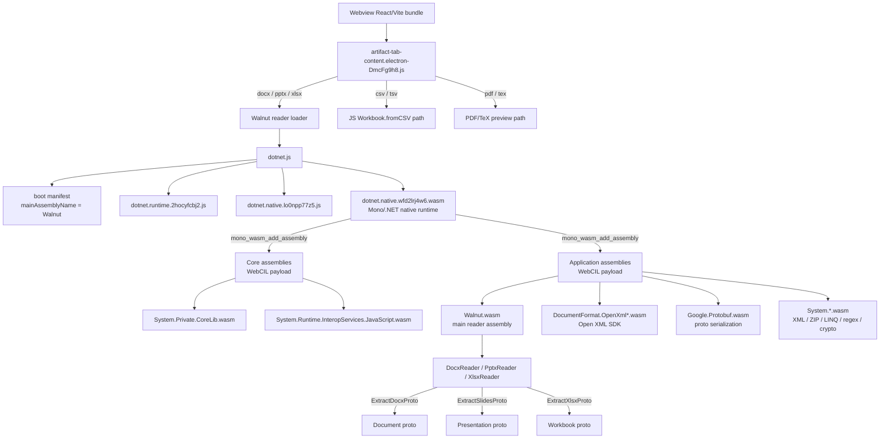
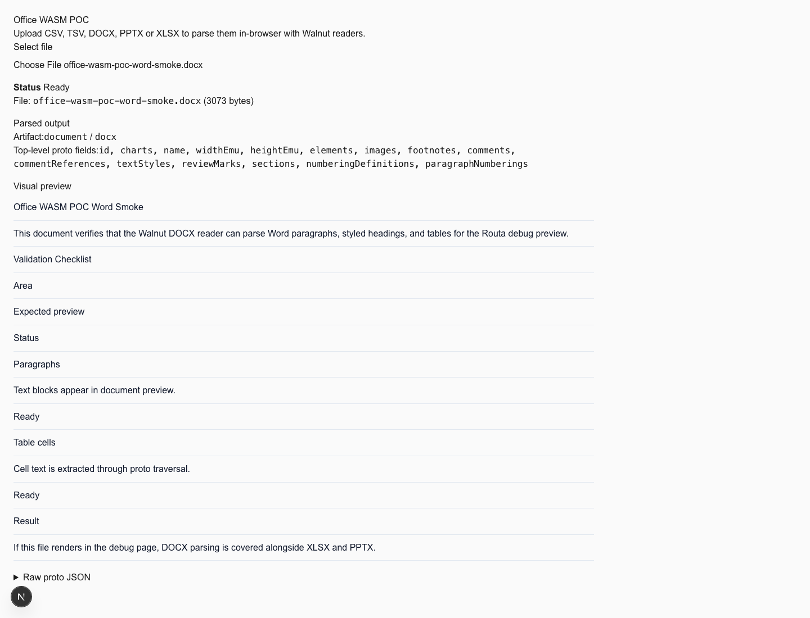
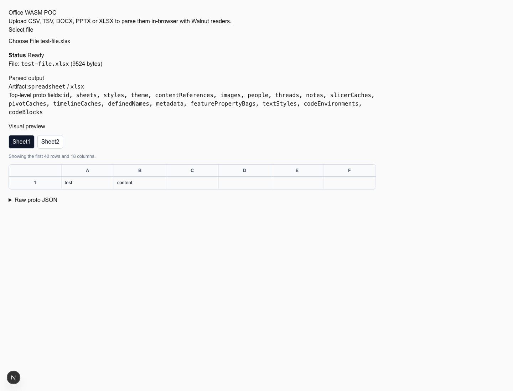
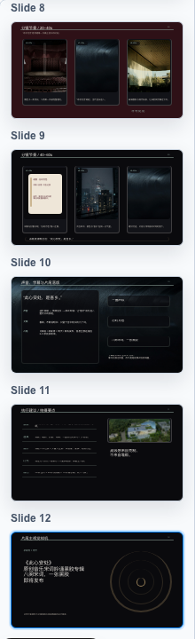

# Office Document Viewer: WASM-based DOCX/PPTX/XLSX/CSV preview

## What Happened

Codex (OpenAI) 的 Electron 桌面应用内嵌了一套完整的 Office 文档预览系统，能在 side panel 中直接渲染 DOCX、PPTX、XLSX、CSV/TSV、PDF 等文件。分析 Codex app 后确认其技术栈和架构如下。

Routa 目前仅有 `file-output-viewer`（代码/搜索结果）和 `reposlide`（PPTX 下载链接），没有内嵌的 Office 文档预览能力。用户需要离开应用才能查看 agent 生成的 .docx/.xlsx/.pptx 文件。

## TODO

- [x] DOCX reader emits Walnut-like `oaiproto.coworker.docx.Document` and passes protocol equivalence for `dll_viewer_solution_test_document.docx`.
- [x] DOCX advanced protocol fields: headers/footers, comments, footnotes/endnotes, basic track changes, hyperlinks, content-control text, floating/anchored images, chart references, paragraph numbering, and table color parity.
- [x] DOCX bookmarks/anchor links, inline content-control placeholders, equations-as-paragraph placeholders, and no-`w:cols` section layout are covered by `docx_advanced_contract.docx` and Walnut parity checks.
- [x] DOCX debug renderer style inheritance: resolve `textStyles[].basedOn` chains so inherited paragraph/run style fields affect rendered text.
- [x] DOCX preserves Walnut-style structural empty paragraphs for body/header/footer/content-control blocks and table cells, reducing real-world element/paragraph count drift.
- [x] DOCX mirrors Walnut scalar quirks for real-world invalid OOXML: uppercase RGB/`AUTO` colors, integer-only paragraph spacing/run font size, and `contextualSpacing`-only empty paragraph fallback to docDefaults.
- [x] DOCX skips generated table-of-contents content controls (`docPartGallery = Table of Contents`) like Walnut and orders root images by main document relationship order parity.
- [x] DOCX resolves paragraph spacing through paragraph-style `basedOn` chains and non-`Normal` default paragraph style IDs.
- [x] DOCX mirrors Walnut root page-size and run-font quirks: root width/height only emit explicit `w:pgSz`, `image/jpeg` is preserved, and `w:rFonts` uses western font slots before East Asian slots.
- [x] DOCX table cells now emit Walnut-like borders/diagonals, gridSpan, vertical alignment, and cell IDs for real-world table parity.
- [x] DOCX paragraph mark run properties now feed paragraph text style, including `w:szCs` and `AUTO` color behavior used by Word-authored styles.
- [x] DOCX table element bbox now honors table horizontal justification against page content width.
- [x] DOCX floating image bbox now reads raw `wp:positionH/wp:positionV@relativeFrom`, applies page/margin/column/paragraph anchor frames, and mirrors Walnut's page-relative vertical offset behavior for real-world anchored images.
- [x] DOCX 1x1 sample/code-block tables now suppress implicit default-black cell-border colors like Walnut, while preserving implicit black borders for ordinary multi-cell tables.
- [x] DOCX root images now include package-level image parts beyond visible body drawings, matching Walnut behavior for numbering/bullet and orphan image parts.
- [x] DOCX revision handling now mirrors Walnut visible-text semantics: insertion marks are retained, deletion text is skipped, empty review/hyperlink/comment marker runs are not emitted, and deletion metadata remains in `reviewMarks`.
- [x] DOCX comment ranges now mirror Walnut revision-container quirks and part scoping: comment range markers inside inserted/deleted runs do not close outer active ranges, and active comment state is cleared between body, notes, and comments parts.
- [x] DOCX ignores endnotes in the Walnut-compatible `footnotes` protocol surface and ignores endnote reference-only runs.
- [x] DOCX rendered page-break text now matches Walnut's `__docxBreak:rendered__` marker for mid-paragraph `w:lastRenderedPageBreak`, while skipping leading page-render markers that Walnut omits.
- [x] DOCX section summaries now emulate Walnut page-break-derived section duplication for single-`sectPr` files, while skipping generated TOC, revision-scoped rendered page breaks, and table-internal rendered breaks.
- [x] DOCX parity tooling now treats Walnut randomized footnote/comment run IDs as unstable and compares stable reference IDs instead.
- [ ] DOCX floating/anchored layout depth: image/chart bbox now honors `wp:anchor` horizontal/vertical align and offset frames for common page/margin/column/paragraph cases. Remaining work is wrap mode, overlap/behind-doc flags, z-order, distance-from-text, crop/effect metadata, and broader relative positioning variants.
- [ ] DOCX chart payload depth: extend beyond chart references and basic cached series into richer axis/title/legend/plot-area styling, multi-axis cases, and embedded chart workbook/cache edge cases.
- [ ] DOCX section/layout depth: multiple section summaries are emitted in document order; remaining work is section-scoped element assignment, per-section page-break semantics, and broader column/header/footer variants.
- [ ] DOCX full style inheritance depth: protocol-level resolution now covers docDefaults spacing, paragraph-style spacing `basedOn`, default paragraph style IDs, paragraph style summaries, renderer-side paragraph `basedOn`, direct run overrides, image/table bbox parity for key layout cases, and table bbox from actual table width. `docx_style_section_contract.docx` confirms Walnut does not materialize character-style `basedOn` into run `textStyle`; `docx_table_style_contract.docx` confirms Walnut does not materialize table-style conditional shading into cell fill. Remaining work is latent style defaults, false-value overrides, run-style materialization beyond direct properties, and richer table border/span/style regions.
- [ ] XLSX precise table styles: table headers, row/column stripe flags, first/last column emphasis, and totals rows are consumed from table style metadata; full theme/table style color definitions are still approximate.
- [x] XLSX icon-set logic: honor `cfvo` type/value for min/max/num/percent/percentile, plus `gte`, `reverse`, `showValue`, and common icon families such as rating/arrows/traffic/symbols.
- [ ] XLSX chart fidelity: preview now consumes `sheet.drawings[].chart` anchors/series/legend from the Walnut-like protocol; plot area, gridlines, fonts, and Excel internal layout are still not pixel-level.
- [ ] XLSX drawing overlays: preview consumes sheet drawing chart/shape anchors and EMU extents; worksheet images and full drawing z-order/crop/effects remain.
- [ ] XLSX freeze panes / sticky headers: prefix-sum layout now drives fixed workbook row/column header overlays; worksheet freeze panes, scroll viewport virtualization, and floating-element hit regions remain.
- [ ] XLSX conditional formatting breadth: negative data bars, axes, gradient/solid variants, and cfvo-driven color scale interpolation are implemented; layered rules still need more coverage.
- [ ] XLSX protocol coverage: add more fixtures and deeper field assertions beyond the current `complex_excel_renderer_test.xlsx` core parity check.
- [ ] PPTX chart parts: emit `charts` and `chartReference` from `c:chart` / `ChartPart` relationships.
- [ ] PPTX group shapes, connectors, and SmartArt/diagram support.
- [ ] PPTX complete theme/layout/master inheritance for fills, lines, text styles, and placeholders.
- [ ] PPTX table parity against Walnut, including cell spans, fills, borders, and text styles.
- [ ] PPTX picture crop, masks, tiling, duotone/advanced effects, and z-order metadata.

PPTX implementation order:

1. Theme/layout/master placeholder inheritance: deepen slide fallback from slide element -> layout placeholder -> master placeholder for text body style, list levels, fills, lines, and placeholder geometry.
2. True chart parts: emit root `Presentation.charts` and slide element `chartReference` from `c:chart` relationships, then add a chart fixture with decoded Walnut parity.
3. PPT tables: cover cell spans, fills, borders, text styles, and renderer parity against a small table fixture.
4. Group/connector/custom geometry: improve group transforms, connector endpoints, and common custom paths before SmartArt/diagram-specific work.
5. Advanced pictures/effects: broaden crop/mask/tile/effect metadata after core text/layout/chart/table paths are stable.
6. Slideshow depth: add slide navigation affordances, notes mode, timing, and transitions after static rendering fidelity is stable.
7. Export/editing: evaluate `ExportProtoToPptx` only after viewer protocol fidelity is mature.

Progress - 2026-05-02:

- PPT preview renderer now applies `Presentation.layouts`/master placeholder inheritance before slide rendering, thumbnail bitmap generation, slideshow rendering, typeface prewarm, and selection hit-testing. The implementation keeps direct slide styles authoritative and fills missing placeholder geometry/text/list defaults from layout/master records.
- PPT render contract now compares decoded screenshot pixels with a tiny antialias tolerance instead of raw PNG bytes, which removes false failures from identical-looking Walnut/Routa previews while still failing on real layout differences.
- PPT viewer shell now puts the slideshow action in the debug page header and computes slide fit independently from notes/sources footnote height, so long footnotes scroll below the slide instead of shrinking the slide.
- Next PPT item remains true chart parts: compare Walnut `c:chart` relationship output against Routa protocol, then render chart placeholders from decoded chart payloads instead of image-only fallbacks.

## Expected Behavior

Routa 应能在 session canvas 或 artifact tab 中直接预览 Office 文档（DOCX/PPTX/XLSX/CSV），提供与 Codex 类似的文件类型路由和渲染体验。

## Current Parity Snapshot - 2026-05-02

- DOCX: `dll_viewer_solution_test_document.docx` 与 `docx_advanced_contract.docx` 已通过 Walnut 协议等价检查；`dll_viewer_solution_test_document.docx` 在 debug 页面上 Walnut/Routa 首屏截图 0 像素差，预览容器可滚动高度一致（`scrollHeight=3728`, `clientHeight=741`）。
- DOCX 当前已补齐默认段落间距/行距的 `docDefaults` 继承，debug renderer 会沿 `textStyles[].basedOn` 合并继承样式，reader 也会按文档顺序输出多个 section summary，并使用实际 table grid/width 计算表格元素 bbox。`docx_style_section_contract.docx` 已覆盖 direct run override、character-style non-materialization、multi-section summary；`docx_table_style_contract.docx` 已覆盖 table bbox parity 和 table-style shading non-materialization；`docx_anchor_layout_contract.docx` 已覆盖 anchor align bbox parity。复杂浮动 wrap/z-order/effects、embedded chart payload、section-scoped layout、协议级完整样式继承仍按 TODO 拆分推进。
- Latest real-world DOCX scan: `/tmp/routa-realworld-docx-both-ok-after-anchor-border.clean.json` over 89 Walnut-readable files from `/Users/phodal/Downloads/realworld` reports 81 semantic-full matches and 8 remaining semantic mismatches. Fixed since the previous scan: nested revision comment range expansion, part-local comment state, mid-paragraph rendered page-break markers, table-internal section break overcounting, table cell border/anchor/gridSpan parity, paragraph mark styles, table horizontal alignment, page-break-derived section summaries, package-level images, endnote exclusion, empty hyperlink/comment/review marker run suppression, deleted-text filtering, raw anchor `relativeFrom` bbox handling, page-relative vertical offset parity, and single-cell table implicit-border-color parity.
- Remaining DOCX mismatches are concentrated in: complex section count/shape inference (5 files), complex table shapes/bboxes/colors (3 files), image reference/order/bbox edge cases (2 files), and hyperlink/footnote/numbering/text-run edge cases in `ebook*.docx` / `output.docx`.

## Codex 技术方案逆向分析

### 1. 文件类型路由

在 `use-model-settings-D_GIIENF.js` 中按扩展名路由到不同 artifact type：

```
csv/tsv/xlsx/xlsm -> artifactType: "spreadsheet"
docx              -> artifactType: "document"
pptx              -> artifactType: "slides"
pdf/tex           -> artifactType: "pdf"
```

### 2. Reader 架构

核心入口在 `artifact-tab-content.electron-DmcFg9h8.js`：

```js
csv  -> Workbook.fromCSV(...).toProto()
tsv  -> Workbook.fromCSV(..., { separator: "\t" }).toProto()
docx -> Document.decode(Walnut.DocxReader.ExtractDocxProto(bytes, false))
pptx -> Presentation.decode(Walnut.PptxReader.ExtractSlidesProto(bytes, false))
xlsx -> Workbook.decode(Walnut.XlsxReader.ExtractXlsxProto(bytes, false))
```

- 非 PDF 文件最大预览限制 40MB
- 解析结果有 5 项 LRU cache
- PDF 直接 base64 data URL 给 PDF panel

### 3. WASM Reader 生成语言和工具链

**C# -> .NET 9 Mono AOT -> browser-wasm**

关键证据：
- `dotnet.runtime.js`: `var e="9.0.14",t="Release"` -> .NET 9.0.14
- `dotnet.native.wasm`: 构建路径含 `Microsoft.NETCore.App.Runtime.Mono.browser-wasm/9.0.14`
- `Walnut.wasm`: 构建路径 `openai/lib/js/oai_js_walnut/obj/wasm/Release/net9.0-browser/linked/Walnut.pdb`
- 依赖: `DocumentFormat.OpenXml` 3.3.0, `Google.Protobuf`

### 4. WASM 文件清单

| 文件 | 大小 | 说明 |
|------|------|------|
| `dotnet.native.wasm` | ~2MB | CoreCLR Mono runtime |
| `Walnut.wasm` | ~1.7MB | 业务代码（Reader） |
| `DocumentFormat.OpenXml.wasm` | ~4.1MB | Open XML SDK |
| `Google.Protobuf.wasm` | ~0.5MB | Protobuf 序列化 |
| `System.*.wasm` | 各 ~100-500KB | BCL 子集（约 20 个） |
| 总计 | ~10-12MB | 完整运行时 |

### 4.1. WASM bundle relationship

`tmp/codex-app-analysis/extracted/webview/assets` 下共有 31 个 `.wasm` 文件。它们不是 31 个彼此直接调用的独立 WASM 模块，而是一套 manifest-driven 的 .NET browser-wasm/WebCIL bundle：

- `dotnet.native.wfd2lrj4w6.wasm` 是唯一真正的 Mono/.NET native runtime WASM，导入 `env` 和 `wasi_snapshot_preview1`，导出 `memory`、`mono_wasm_add_assembly`、`mono_wasm_load_runtime`、`mono_wasm_invoke_jsexport`、`malloc`、`free` 等运行时 API。
- 其余 30 个 `.wasm` 都是 WebCIL 包装的 .NET assembly。它们的 WASM import 都只有 `webcil`，export 也都是 `webcilVersion`、`webcilSize`、`getWebcilSize`、`getWebcilPayload`，由 .NET runtime 解包并作为 assembly 加载。
- `artifact-tab-content.electron-DmcFg9h8.js` 内嵌启动清单，`mainAssemblyName` 是 `Walnut`；`resources.fingerprinting` 把哈希文件名映射回逻辑名，例如 `Walnut.nvqhqmqbjk.wasm -> Walnut.wasm`、`dotnet.native.wfd2lrj4w6.wasm -> dotnet.native.wasm`。
- `resources.coreAssembly` 只包含 `System.Private.CoreLib` 和 `System.Runtime.InteropServices.JavaScript`；`resources.assembly` 包含 `Walnut`、`DocumentFormat.OpenXml*`、`Google.Protobuf` 和其余 `System.*` 依赖。



这意味着 Routa 如果参考这条路线，真正需要复制的架构不是“多个 WASM 模块互相依赖”，而是：

```text
JS artifact router
  -> .NET browser-wasm loader
  -> native runtime wasm
  -> WebCIL assembly set
  -> narrow reader ABI: bytes -> proto bytes
  -> React artifact panels
```

### 5. 渲染层

解析后的 proto 交给三个 React panel：
- `PopcornElectronDocumentPanel` - DOCX 渲染（paragraph/run/style/table/image/hyperlink 等）
- `PopcornElectronPresentationPanel` - PPTX 渲染（slide/layout/shape/picture/chart/table 等）
- `PopcornElectronWorkbookPanel` - XLSX 渲染（workbook/sheet/cell/formula/chart 等）

DOCX 有 feature gate (`839469903`)：开启走 Walnut，否则走 `docx-preview` 库的 `renderAsync`。

### 6. 整体链路图

```
用户点击文件 -> 扩展名路由 -> read-file-binary -> bytes
    |
    +-- csv/tsv -> JS Workbook.fromCSV() -> workbook proto
    +-- docx    -> Walnut.DocxReader.ExtractDocxProto() -> document proto
    +-- pptx    -> Walnut.PptxReader.ExtractSlidesProto() -> presentation proto
    +-- xlsx    -> Walnut.XlsxReader.ExtractXlsxProto() -> workbook proto
    +-- pdf     -> base64 data URL
    |
    v
React Panel 渲染（Popcorn*）
```

## Protocol Deep Dive - 2026-05-01

Codex 的 Office 预览可以拆成三层协议：Electron IPC 传输层、app-server RPC 层、WASM/protobuf reader ABI 层。

### 1. Electron IPC transport

Preload bridge 暴露 `window.electronBridge`，renderer 不直接接触 Electron 的 `ipcRenderer`：

```js
window.electronBridge.sendMessageFromView(message)
```

实际传输 channel：

```text
renderer
  -> window.electronBridge.sendMessageFromView(...)
  -> ipcRenderer.invoke("codex_desktop:message-from-view", message)
  -> main process

main process
  -> webContents.send("codex_desktop:message-for-view", message)
  -> preload dispatch window MessageEvent("message")
  -> renderer message bus
```

关键 channel：

```text
codex_desktop:message-from-view
codex_desktop:message-for-view
codex_desktop:mcp-app-sandbox-host-message
```

这里的 Electron 层只是一个通用 message tunnel，Office 文件解析不在 main process 中完成。

### 2. App-server request protocol

Renderer message bus 将业务请求包装成 request envelope：

```js
{
  type: "mcp-request",
  hostId,
  request: {
    id,
    method,
    params
  }
}
```

请求管理器维护 `requestPromises`，以 request `id` 做关联：

```text
createRequest(method, params)
sendRequest(method, params)
onResult(id, result)
onError(id, error)
```

Office reader 主要依赖这些 method：

```text
read-file-metadata      -> { isFile, sizeBytes }
read-file-binary        -> { contentsBase64 }
compile-latex-artifact  -> { contentsBase64 }
```

二进制文件内容通过 base64 string 跨 IPC/RPC 边界传输，而不是直接传 `ArrayBuffer`：

```text
contentsBase64 -> atob(...) -> Uint8Array
```

这意味着 desktop host 的职责是定位 host/workspace 文件、读取 bytes、返回 base64；DOCX/PPTX/XLSX 解析在 renderer 内继续执行。

### 3. WASM reader ABI

Renderer 初始化 .NET browser-wasm runtime，并加载主 assembly `Walnut`：

```text
dotnet.withConfig(config).create()
  -> getAssemblyExports("Walnut")
```

WASM 边界上的 reader ABI 非常窄：

```text
Uint8Array OfficeFileBytes
  -> Walnut reader export
  -> Uint8Array ProtobufBytes
```

具体导出方法：

```js
DocxReader.ExtractDocxProto(bytes, false)
PptxReader.ExtractSlidesProto(bytes, false)
XlsxReader.ExtractXlsxProto(bytes, false)
```

JS 侧再用生成的 protobuf wrapper 解码：

```js
Document.decode(protoBytes)
Presentation.decode(protoBytes)
Workbook.decode(protoBytes)
```

CSV/TSV 不走 WASM，直接由 JS parser 构造同一个 `Workbook` proto；PDF 不走 artifact proto reader，而是转 data URL 给 PDF panel。

### 4. Internal artifact proto model

Codex 没有把 OpenXML DOM 或 HTML 直接交给 React 渲染，而是归一化成内部 artifact schema：

```text
DOCX -> Document proto
PPTX -> Presentation proto
XLSX/CSV/TSV -> Workbook proto
```

从生成的 wrapper 和 WASM symbols 看，schema 覆盖范围包括：

- `Document`: section、paragraph、run、style、table、image、hyperlink、numbering、header/footer、footnote、comment、review 等
- `Presentation`: slide、layout、theme、shape、picture、table、chart、speaker notes、comment、master/layout relationship 等
- `Workbook`: workbook、sheet、cell、format、shared string、formula、conditional formatting、data validation、table/autofilter、defined name、chart、pivot table/cache、slicer、timeline、sparkline、comment 等

这个 proto model 是 UI panel 的稳定输入格式，也是未来编辑/导出能力可能复用的中间层。

### 5. Full preview path

```text
user opens file.xlsx
  -> extension routing creates artifact tab
  -> read-file-metadata(hostId, path)
  -> read-file-binary(hostId, path)
  -> base64 decode to Uint8Array
  -> XlsxReader.ExtractXlsxProto(bytes, false)
  -> Workbook.decode(protoBytes)
  -> PopcornElectronWorkbookPanel
```

DOCX/PPTX 同理：

```text
docx -> DocxReader -> Document proto -> PopcornElectronDocumentPanel
pptx -> PptxReader -> Presentation proto -> PopcornElectronPresentationPanel
xlsx -> XlsxReader -> Workbook proto -> PopcornElectronWorkbookPanel
```

### 6. Reader/export implications

WASM strings 里能看到 read 和 export 双向能力相关符号：

```text
ExtractDocxProto
ExtractSlidesProto
ExtractXlsxProto
ExportProtoToDocx
ExportProtoToPptx
ExportProtoToXlsx
```

这不代表 Codex UI 一定暴露完整编辑写回，但说明底层 reader 层并不只是“一次性 HTML preview”。更准确的抽象是：

```text
Office binary <-> normalized proto artifact model <-> React panel/editor
```

对 Routa 来说，这个发现会影响方案选择：如果只做快速预览，JS library 足够启动；如果要长期支持 artifact 编辑、结构化 diff、agent 修订、导出回 Office，则应该尽早设计一个稳定的中间 artifact schema。

## Why This Might Happen

这是功能缺失而非 bug。Routa 的 session canvas 和 kanban card 已经有 artifact 展示机制，但没有 Office 文档的解析和渲染能力。

## Implementation Approaches

### 方案 A: 复用 Codex 的 .NET WASM 路线

- 优点：解析质量高，Open XML SDK 是官方库，覆盖全面
- 缺点：需要 C# 代码维护，WASM 体积 ~10-12MB，需要 .NET 运行时
- 可行性：`DocumentFormat.OpenXml` 是 MIT 开源，`Walnut` 是 OpenAI 自研的 reader 层（闭源），需要自行实现 reader
- 风险：无法直接复用 Walnut 源码，需要重写 C# reader 层

### 方案 B: 纯 JS/TS 方案

- DOCX: `docx-preview`（MIT，Codex 也在用作为 fallback）
- XLSX: `SheetJS` 或 `hyperformula`
- PPTX: `pptxjs` 或自研简版 renderer
- CSV: 已有轻量 JS 实现
- 优点：无 WASM 开销，bundle 更小，与现有 TS 技术栈统一
- 缺点：PPTX/DOCX 渲染质量可能不如原生 OpenXML 解析

### 方案 C: 服务端渲染

- 在 Rust/Axum 后端解析 Office 文档，返回结构化 JSON 或渲染图
- 优点：前端零负担
- 缺点：增加后端复杂度，大文件传输延迟

### 方案 D: 混合方案（推荐评估）

- CSV/TSV: 纯 JS（轻量，已验证可行）
- DOCX: `docx-preview` 或类似 JS 库
- PDF: `pdf.js`（成熟）
- XLSX/PPTX: 评估 JS 库质量，必要时考虑 WASM 路线

## Relevant Files

- `src/client/components/file-output-viewer.tsx` - 现有文件输出 viewer（仅代码/搜索）
- `src/app/workspace/[workspaceId]/sessions/[sessionId]/use-session-canvas-artifacts.ts` - Canvas artifact 管理
- `src/core/reposlide/deck-artifact.ts` - 现有 PPTX 下载（无预览）
- `src/app/debug/office-wasm-poc/` - 当前本地 debug POC
- `scripts/debug/check-office-wasm-poc-consistency.ts` - 校验 POC 和 Codex extracted bundle 的 ABI/manifest 一致性
- `docs/references/office-document-viewer-wasm-reader/` - 后续参考实现目录和产品化拆分建议
- `tmp/codex-app-analysis/` - Codex 逆向分析文件（ignored）

## Open Questions

1. **渲染精度要求**: Routa 的用户场景是"快速预览 agent 输出"还是"精确还原 Office 格式"？
2. **PPTX 渲染**: 纯 JS 的 PPTX renderer 质量是否够用？是否值得走 WASM 路线？
3. **Bundle 体积约束**: 桌面端 (Tauri) 对 WASM 体积容忍度高，Web 端是否需要按需加载？
4. **Protobuf vs JSON**: Codex 用 protobuf 传输解析结果，我们是否需要这一层？还是直接用 JSON 更简单？
5. **是否需要编辑能力**: Codex 的 Walnut 至少编译了 `ExportProtoToDocx` / `ExportProtoToPptx` / `ExportProtoToXlsx` 符号；Routa 是只需要预览，还是要预留 artifact 编辑与导出回 Office 的中间 schema？

## Protocol Parity Finding - 2026-05-01

The current Routa-owned WASM reader matches the Walnut ABI names and dependency family, but it does **not** match the returned protobuf protocol. This is the main reason the generated PPTX preview is mostly plain text.

Run:

```bash
npm run compare:office-wasm-reader:pptx
```

Fixture:

```text
tools/office-wasm-reader/fixtures/agentic_ui_proactive_agent_technical_blueprint.pptx
```

Observed protocol delta:

| Reader | ABI method | Returned message | Proto bytes | First slide visual data |
| --- | --- | --- | ---: | --- |
| Walnut | `PptxReader.ExtractSlidesProto(bytes, false)` | `oaiproto.coworker.presentation.Presentation` | `119233` | `23` elements: `11` text elements + `12` shape elements |
| Routa generated | `PptxReader.ExtractSlidesProto(bytes, false)` | `routa.office.v1.OfficeArtifact` | `32007` | `0` elements; only `15` text blocks |

Walnut first-slide keys:

```text
index, useLayoutId, elements, widthEmu, heightEmu, innerXml, outerXml,
background, id, notesSlide, creationId
```

Routa first-slide keys:

```text
index, textBlocks, title
```

The missing contract is therefore not "embedded images" for this fixture. The fixture has no media files in `ppt/media`; its visual appearance is carried by vector slide elements: background, positioned shapes, fills, lines, rounded rectangles, text boxes, and styled text runs.

Minimum protocol target for PPTX parity:

- Top level: `Presentation.theme`, `Presentation.layouts`, `Presentation.images`, `Presentation.charts`.
- Slide level: `id`, `index`, `useLayoutId`, `widthEmu`, `heightEmu`, `background`, `elements`.
- Element level: `id`, `name`, `type`, `bbox`, `shape`, `fill`, `line`, `paragraphs`, plus image/table/chart references.
- Text level: paragraphs and runs with `textStyle` (`fontSize`, `fill.color`, `typeface`, bold/italic/underline).

Implementation implication: keep the exported method names, but change the generated PPTX payload to converge on the Walnut `Presentation` shape, or add a faithful adapter that maps a Routa-owned equivalent schema to that same shape before rendering. Extending the current `OfficeArtifact.Slide.text_blocks` model is insufficient.

Follow-up implementation:

- `Routa.OfficeWasmReader.PptxReader.ExtractSlidesProto` now emits a Walnut-like `oaiproto.coworker.presentation.Presentation` payload instead of `routa.office.v1.OfficeArtifact` for PPTX.
- The generated payload is decoded with the extracted `Presentation.decode` module in both `/debug/office-wasm-poc` and `npm run compare:office-wasm-reader:pptx`.
- On `agentic_ui_proactive_agent_technical_blueprint.pptx`, protocol-level equivalence now matches slide count, first-slide size, first-slide background, first-slide positioned element presence, first-slide text style presence, and first-slide element count (`23`, matching Walnut: `11` text + `12` shape elements).
- Known remaining gap: the emitted proto is structurally compatible but not byte-identical; theme/layout payloads are still minimal compared with Walnut's full reader output.

PPTX parity regression guard:

```bash
npm run test:office-wasm-reader:pptx-parity
```

The committed parity fixture stays small. Large local image-heavy decks can still be checked explicitly without adding them to git:

```bash
npm run compare:office-wasm-reader:pptx -- --assert '/Users/phodal/Downloads/《此心安处》 方案 by GPT Pro.pptx'
```

`《此心安处》` is not a real PowerPoint chart-object case: its package has `ppt/charts/` but no chart XML parts, and Walnut also decodes `chartCount = 0`. The visible "chart-like" content is carried by images and shapes. The current parity check therefore verifies the relevant contract for this deck: root `Presentation.images`, image byte SHA-256 digests, element `imageReference` id sequences, `imageReference` resolution, slide counts, layout/theme presence, element counts, image-reference counts, and per-slide element type counts.

Walnut-specific finding from decoding both WASM outputs on this deck: root `Presentation.images` is emitted in ordinal path order (`/ppt/media/...`) rather than slide traversal order. Walnut does not appear to transcode the JPEG payloads for this fixture; after matching the ordering, image ids, content types, byte lengths, and SHA-256 digests match exactly. The generated debug preview on `http://localhost:3000/debug/office-wasm-poc` now shows slide 4 with multiple distinct image-backed elements instead of one repeated image.

PPTX render-contract guard:

```bash
npm run compare:office-wasm-reader:pptx-render -- --assert '/Users/phodal/Downloads/《此心安处》 方案 by GPT Pro.pptx'
npm run test:office-wasm-reader:pptx-render
```

- `compare-walnut-pptx-render-contract.ts` opens the debug page through Playwright, loads the same PPTX through both `reader=routa` and `reader=walnut`, and captures desktop, narrow, and slideshow screenshots into `/tmp/routa-office-wasm-pptx-render`.
- The guard asserts that both readers render from bitmap surfaces instead of live fallback canvases, enter fullscreen slideshow, keep the same layout stats, avoid runtime console errors, and produce identical preview/slideshow screenshot hashes.
- The `test:*` script can start an isolated Next dev server on port `3218`; the `compare:*` script can target an already-running app at `http://127.0.0.1:3000/debug/office-wasm-poc` or a custom `--base-url`.

Remaining implementation gaps after the image-reference/theme/layout pass:

- True PPTX chart parts (`c:chart` / `ChartPart`) are not emitted as `charts` or `chartReference` yet.
- Group shapes, connectors, SmartArt/diagrams, video/audio, comments, notes, and custom geometry paths are still not fully modeled.
- Theme and layout payloads are structurally present but not byte-identical to Walnut; text style inheritance from master/layout placeholders is still shallow.
- Table support is minimal and not parity-tested against Walnut tables.
- Picture crop/mask, tiling, duotone, advanced effects, gradients/pattern fills, and z-order metadata need broader coverage.
- Export back to PPTX (`ExportProtoToPptx`-style flow) is not implemented.

## DOCX Protocol Parity - 2026-05-01

`Routa.OfficeWasmReader.DocxReader.ExtractDocxProto` now emits a Walnut-like `oaiproto.coworker.docx.Document` payload for DOCX instead of the older `routa.office.v1.OfficeArtifact` text/table projection.

Validated fixtures:

```text
tools/office-wasm-reader/fixtures/dll_viewer_solution_test_document.docx
tools/office-wasm-reader/fixtures/docx_advanced_contract.docx
tools/office-wasm-reader/fixtures/docx_style_section_contract.docx
tools/office-wasm-reader/fixtures/docx_table_style_contract.docx
tools/office-wasm-reader/fixtures/docx_anchor_layout_contract.docx
```

Walnut parity checks now match for these fixtures:

- document page size (`widthEmu = 12240`, `heightEmu = 15840`)
- element count and type counts (`26` text, `1` image reference, `7` tables)
- embedded image id/content type/byte length/SHA-256 digest
- image reference ids and reference resolution
- paragraph count and text run count
- table row/cell shapes and newline-preserving table previews
- section count and numbering definition count
- paragraph style definition count (`36`) and ids
- docDefaults paragraph spacing/line spacing inheritance
- multi-section summaries in document order, including continuous section breaks and column counts
- direct run overrides while preserving Walnut's character-style `basedOn` non-materialization behavior
- table element bounding boxes use the actual table grid/table width instead of the full content width
- anchored image/chart bbox calculation honors common `wp:anchor` horizontal/vertical align and offset frames

Important Walnut-specific findings:

- `Document.name` is empty for this fixture even though the DOCX core properties have a title-like value; the generated reader mirrors Walnut and does not write the root name field.
- DOCX text runs must preserve original spaces and explicit line breaks. Reusing the earlier `TextNormalization.Clean` behavior collapsed code blocks and reduced the text run count.
- Walnut emits paragraph styles only. Writing every style from `styles.xml` produced `164` styles; filtering to `StyleValues.Paragraph` matches Walnut's `36` style definitions.
- Walnut element ids for inline images appear non-semantic/random across runs, so equivalence tests intentionally compare image ids/references and payload digests rather than element ids or raw proto bytes.
- Walnut root document page size only emits explicit `w:pgSz` values; documents without an explicit page size leave root width/height unset even though layout geometry still uses fallback page metrics.
- Walnut emits direct run overrides, but does not materialize character-style `basedOn` chains into run `textStyle`.
- Walnut does not materialize table-style conditional shading (`firstRow`, banded rows, `lastRow`, `firstCol`) into table cell `fill`; direct cell shading is still emitted and remains covered separately.
- Walnut preserves text elements for structurally significant empty paragraphs in body/header/footer/content-control blocks and table cells. Routa now mirrors that behavior and resolves empty-paragraph spacing through the default paragraph style/docDefaults when Walnut does.
- Walnut writes RGB color values in uppercase and ignores invalid decimal strings for integer-only paragraph spacing and run font size fields. Routa still keeps decimal-tolerant parsing for page margins/table metrics, where that tolerance is needed to avoid reader crashes on real documents.
- A terminal empty paragraph with `w:contextualSpacing` but no `w:spacing` is not treated as a pure empty paragraph by Walnut; it falls back to docDefaults spacing, including explicit `0` values.
- Walnut skips generated TOC content controls identified by `w:docPartGallery w:val="Table of Contents"`; normal content controls remain emitted.
- Walnut root `Document.images` ordering follows the reverse of the main document relationship order for image relationships. Image reference order is still traversal order and was already matching for the image-only mismatch samples.
- Walnut resolves paragraph style spacing through `w:basedOn` chains and uses the `w:default="1"` paragraph style ID when a paragraph has no explicit style; this matters for WPS files whose default style is not named `Normal`.
- Walnut run `typeface` prefers `w:rFonts/@w:ascii` or `@w:hAnsi` before East Asian slots; East Asian-only font declarations are often not materialized into run `textStyle`.
- Walnut preserves `image/jpeg` content type spelling and emits `w:color w:val="auto"` as `AUTO` in the protocol color value.

DOCX parity regression guards:

```bash
npm run test:office-wasm-reader:docx-parity
node --import tsx scripts/office-wasm-reader/run-office-wasm-fixtures.ts --only dll_viewer_solution_test_document --only docx_advanced_contract --only docx_style_section_contract --only docx_table_style_contract --only docx_anchor_layout_contract
```

Verification on 2026-05-02:

- `npm run build:office-wasm-reader` passed.
- `npm run test:office-wasm-reader:docx-parity` passed for all five DOCX fixtures, with 31/31 semantic checks passing per fixture.
- `node --import tsx scripts/office-wasm-reader/run-office-wasm-fixtures.ts --only dll_viewer_solution_test_document --only docx_advanced_contract --only docx_style_section_contract --only docx_table_style_contract --only docx_anchor_layout_contract` passed.
- `npx eslint --max-warnings=0 scripts/office-wasm-reader/compare-walnut-docx-protocol.ts src/app/debug/office-wasm-poc/office-preview-utils.ts src/app/debug/office-wasm-poc/__tests__/presentation-renderer.test.ts` passed.
- `npx vitest run src/app/debug/office-wasm-poc/__tests__/presentation-renderer.test.ts` passed.
- Full `npm run test:office-wasm-reader:fixtures` passes the DOCX fixtures and currently stops on `complex_excel_renderer_test` XLSX golden drift; this was not updated as part of the DOCX parity work.
- 2026-05-02 real-world DOCX scan: a local 166-file DOCX corpus now parses with 166/166 success after hardening fractional twips in page setup/table metrics and tolerating duplicate paragraph style / abstract numbering ids. The original crash was caused by section `w:pgMar` values such as `1440.0000000000002`, which the OpenXML SDK rejects when accessed through integer `.Value` properties.
- 2026-05-02 Walnut/Routa protocol scan on the same 166-file corpus: Routa succeeded on 166/166; Walnut failed on 77/166 (`65` decimal integer attribute failures, `9` duplicate key failures, `3` invalid enum failures). Among the 89 files both readers decoded, full semantic parity improved from 17/89 to 67/89 after preserving Walnut-style empty paragraphs, normalizing RGB/`AUTO` casing, using strict integer parsing for paragraph spacing/run font size, honoring `contextualSpacing` on empty paragraphs, skipping generated TOC content controls, matching Walnut's root image relationship ordering, preserving explicit root page-size semantics, resolving paragraph-style/default-style spacing, and matching Walnut run-font slot priority. Raw proto bytes still matched on 0/89.
- The same post-fix 89-file scan reduced `elementCountMatches` failures from 53 to 3, `elementTypeCountsMatch` from 53 to 3, `paragraphCountMatches` from 54 to 3, `paragraphSpacingSignaturesMatch` from 66 to 11, `textRunStyleSignaturesMatch` from 45 to 14, `imageDigestsMatch` from 22 to 7, and eliminated the 9 `pageSizeMatches` failures. The dominant remaining mismatches are run style/text segmentation (`14`), section shapes/counts (`13`), text run counts (`12`), paragraph spacing (`11`), table shapes/bbox (`9`), footnote refs (`7`), image counts/digests (`7`), table colors (`6`), and hyperlinks (`5`).
- None of the previously full-matching files regressed; the newly full-matching files are mostly blank/near-empty, empty-paragraph, RGB/AUTO casing, decimal spacing/font-size, contextual-spacing-only, generated-TOC, explicit-page-size, paragraph-style inheritance/default-style, image-content-type, image-order, or font-slot-priority cases.

Remaining DOCX implementation gaps:

- Headers/footers, comments, footnotes/endnotes, basic track changes, hyperlinks, content-control text, floating/anchored images, chart references, paragraph numbering, and table color parity are now modeled and covered by parity checks for the committed fixture.
- `docx_advanced_contract.docx` now covers bookmarks/anchor hyperlinks, inline content-control placeholders, equations-as-paragraph placeholders, and no-`w:cols` section layout against Walnut.
- Debug rendering now resolves paragraph style inheritance through `textStyles[].basedOn`, so inherited `textStyle`, `paragraphStyle`, spacing, alignment, and related paragraph fields affect the preview without changing the Walnut-like protocol payload.
- The DOCX reader now emits multiple section summaries in document order, instead of collapsing the protocol surface to the last section only.
- `docx_style_section_contract.docx` records a Walnut-specific behavior: direct run overrides are emitted, but character-style `basedOn` chains are not materialized into run `textStyle`.
- `docx_table_style_contract.docx` records table bbox parity and a Walnut-specific behavior: table-style conditional shading is not materialized into cell `fill`.
- `docx_anchor_layout_contract.docx` records anchor align bbox parity for image references.
- Structural empty body/header/footer/content-control/table-cell paragraphs are now modeled with Walnut-like default spacing resolution. The remaining element/paragraph count drift is limited to complex ebook/output-style samples with large table/image/footnote/run deltas.
- Invalid decimal paragraph spacing/run font size values now follow Walnut's strict integer behavior; fractional page/table metrics remain decimal-tolerant because those are required for robust document loading.
- Generated table-of-contents content controls are skipped to match Walnut, but deeper field-code rendering differences remain in complex TOC/ebook samples.
- Root image ordering now matches Walnut for main document image relationships; remaining image digest mismatches are likely non-main-part ordering, image count differences, or complex image/reference payloads.
- Remaining layout/protocol gaps are richer floating/anchored positioning, embedded chart payload coverage beyond references/basic cached series, section-scoped element/layout mapping, rendered-page/section pagination, field-code/content-control text segmentation, and protocol-level full style inheritance.
- Protocol-level style inheritance is still partial: the current pass captures docDefaults spacing, paragraph-style spacing `basedOn`, default paragraph style IDs, direct run/paragraph properties, paragraph style definitions, renderer-side paragraph basedOn inheritance, actual table width for bbox, and common anchored image/chart bbox alignment, but it does not yet fully materialize false-value overrides, latent style defaults, character styles, run-style chains, or richer table border/span/style regions.
- The debug renderer supports the Walnut-like structure but remains a POC renderer, not the final document panel.

## Verification - 2026-05-01

Implemented a debug proof-of-concept page at `/debug/office-wasm-poc` that loads Codex's extracted Walnut WASM reader assets from `tmp/codex-app-analysis/extracted/webview/assets`.

Validated with local files from `~/Downloads`:

- DOCX: `/Users/phodal/Downloads/office-wasm-poc-word-smoke.docx`
- XLSX: `/Users/phodal/Downloads/test-file.xlsx`
- PPTX: `/Users/phodal/Downloads/agentic_ui_proactive_agent_technical_blueprint.pptx`
- PPTX with images/layout smoke: `/Users/phodal/Downloads/《此心安处》 方案 by GPT Pro.pptx`

Checks run:

```bash
npm run debug:office-wasm:check
npx eslint --max-warnings=0 'src/app/debug/office-wasm-poc/page-client.tsx'
npx tsc --noEmit --pretty false
```

The consistency check validates that the POC runtime config, module filenames, reader ABI names, and panel contracts still match `tmp/codex-app-analysis/extracted/webview/assets/artifact-tab-content.electron-DmcFg9h8.js`.

Additional browser smoke validation after adding the Codex-like PPTX split layout:

- DOCX/DOCUMENT preview still renders expected text/table content.
- XLSX/SPREADSHEET preview still renders sheet tabs and cells.
- Existing PPTX preview still renders expected title content.
- `《此心安处》` PPTX renders as left thumbnail rail plus right slide canvas, with scrollable page container, scrollable thumbnail rail, and 22 image-backed elements detected in the preview DOM.
- Compared slide 12 against a LibreOffice-rasterized PPTX reference via `browser-use`; fixed alpha/background/line rendering and thumbnail font scaling so the thumbnail rail no longer shows oversized text or solid transparent shapes.
- Removed the noisy debug copy above the preview; the POC now keeps only a compact upload/status bar and the folded raw proto JSON panel.

Screenshots:








## References

- Codex 分析文件: `tmp/codex-app-analysis/extracted/webview/assets/`
- Electron preload bridge: `tmp/codex-app-analysis/extracted/.vite/build/preload.js`
- Electron main IPC handlers: `tmp/codex-app-analysis/extracted/.vite/build/main-SLemWUtC.js`
- Artifact tab reader: `tmp/codex-app-analysis/extracted/webview/assets/artifact-tab-content.electron-DmcFg9h8.js`
- Protobuf wrappers: `document-BOb5tmtr.js`, `presentation-DFBGauUV.js`, `spreadsheet-Bpv2Ypgr.js`
- Open XML SDK: https://github.com/dotnet/Open-XML-SDK (MIT)
- docx-preview: https://github.com/VolodymyrBayworker/docx-preview
- SheetJS: https://sheetjs.com/
