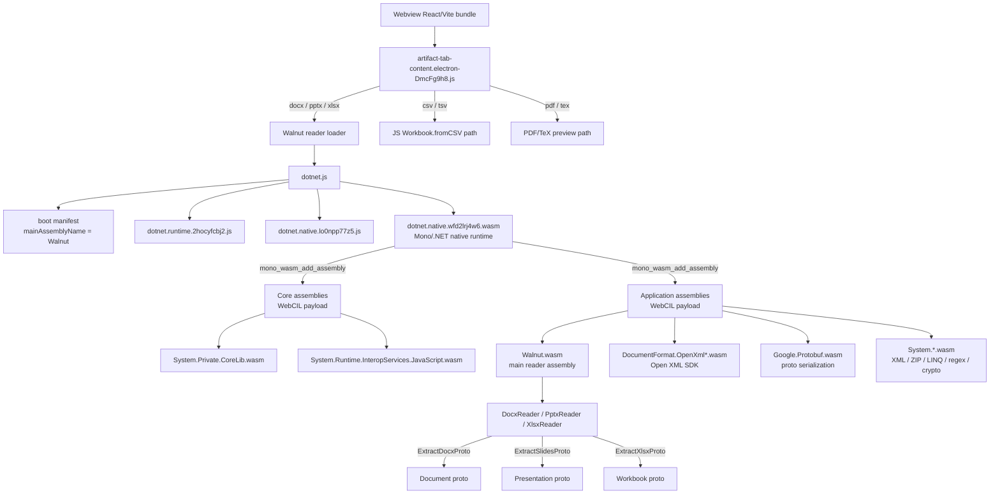

# Office Document Viewer: WASM-based DOCX/PPTX/XLSX/CSV preview

## What Happened

Codex (OpenAI) 的 Electron 桌面应用内嵌了一套完整的 Office 文档预览系统，能在 side panel 中直接渲染 DOCX、PPTX、XLSX、CSV/TSV、PDF 等文件。分析 Codex app 后确认其技术栈和架构如下。

Routa 目前仅有 `file-output-viewer`（代码/搜索结果）和 `reposlide`（PPTX 下载链接），没有内嵌的 Office 文档预览能力。用户需要离开应用才能查看 agent 生成的 .docx/.xlsx/.pptx 文件。

## Expected Behavior

Routa 应能在 session canvas 或 artifact tab 中直接预览 Office 文档（DOCX/PPTX/XLSX/CSV），提供与 Codex 类似的文件类型路由和渲染体验。

## Codex 技术方案逆向分析

### 1. 文件类型路由

在 `use-model-settings-D_GIIENF.js` 中按扩展名路由到不同 artifact type：

```
csv/tsv/xlsx/xlsm -> artifactType: "spreadsheet"
docx              -> artifactType: "document"
pptx              -> artifactType: "slides"
pdf/tex           -> artifactType: "pdf"
```

### 2. Reader 架构

核心入口在 `artifact-tab-content.electron-DmcFg9h8.js`：

```js
csv  -> Workbook.fromCSV(...).toProto()
tsv  -> Workbook.fromCSV(..., { separator: "\t" }).toProto()
docx -> Document.decode(Walnut.DocxReader.ExtractDocxProto(bytes, false))
pptx -> Presentation.decode(Walnut.PptxReader.ExtractSlidesProto(bytes, false))
xlsx -> Workbook.decode(Walnut.XlsxReader.ExtractXlsxProto(bytes, false))
```

- 非 PDF 文件最大预览限制 40MB
- 解析结果有 5 项 LRU cache
- PDF 直接 base64 data URL 给 PDF panel

### 3. WASM Reader 生成语言和工具链

**C# -> .NET 9 Mono AOT -> browser-wasm**

关键证据：
- `dotnet.runtime.js`: `var e="9.0.14",t="Release"` -> .NET 9.0.14
- `dotnet.native.wasm`: 构建路径含 `Microsoft.NETCore.App.Runtime.Mono.browser-wasm/9.0.14`
- `Walnut.wasm`: 构建路径 `openai/lib/js/oai_js_walnut/obj/wasm/Release/net9.0-browser/linked/Walnut.pdb`
- 依赖: `DocumentFormat.OpenXml` 3.3.0, `Google.Protobuf`

### 4. WASM 文件清单

| 文件 | 大小 | 说明 |
|------|------|------|
| `dotnet.native.wasm` | ~2MB | CoreCLR Mono runtime |
| `Walnut.wasm` | ~1.7MB | 业务代码（Reader） |
| `DocumentFormat.OpenXml.wasm` | ~4.1MB | Open XML SDK |
| `Google.Protobuf.wasm` | ~0.5MB | Protobuf 序列化 |
| `System.*.wasm` | 各 ~100-500KB | BCL 子集（约 20 个） |
| 总计 | ~10-12MB | 完整运行时 |

### 4.1. WASM bundle relationship

`tmp/codex-app-analysis/extracted/webview/assets` 下共有 31 个 `.wasm` 文件。它们不是 31 个彼此直接调用的独立 WASM 模块，而是一套 manifest-driven 的 .NET browser-wasm/WebCIL bundle：

- `dotnet.native.wfd2lrj4w6.wasm` 是唯一真正的 Mono/.NET native runtime WASM，导入 `env` 和 `wasi_snapshot_preview1`，导出 `memory`、`mono_wasm_add_assembly`、`mono_wasm_load_runtime`、`mono_wasm_invoke_jsexport`、`malloc`、`free` 等运行时 API。
- 其余 30 个 `.wasm` 都是 WebCIL 包装的 .NET assembly。它们的 WASM import 都只有 `webcil`，export 也都是 `webcilVersion`、`webcilSize`、`getWebcilSize`、`getWebcilPayload`，由 .NET runtime 解包并作为 assembly 加载。
- `artifact-tab-content.electron-DmcFg9h8.js` 内嵌启动清单，`mainAssemblyName` 是 `Walnut`；`resources.fingerprinting` 把哈希文件名映射回逻辑名，例如 `Walnut.nvqhqmqbjk.wasm -> Walnut.wasm`、`dotnet.native.wfd2lrj4w6.wasm -> dotnet.native.wasm`。
- `resources.coreAssembly` 只包含 `System.Private.CoreLib` 和 `System.Runtime.InteropServices.JavaScript`；`resources.assembly` 包含 `Walnut`、`DocumentFormat.OpenXml*`、`Google.Protobuf` 和其余 `System.*` 依赖。



这意味着 Routa 如果参考这条路线，真正需要复制的架构不是“多个 WASM 模块互相依赖”，而是：

```text
JS artifact router
  -> .NET browser-wasm loader
  -> native runtime wasm
  -> WebCIL assembly set
  -> narrow reader ABI: bytes -> proto bytes
  -> React artifact panels
```

### 5. 渲染层

解析后的 proto 交给三个 React panel：
- `PopcornElectronDocumentPanel` - DOCX 渲染（paragraph/run/style/table/image/hyperlink 等）
- `PopcornElectronPresentationPanel` - PPTX 渲染（slide/layout/shape/picture/chart/table 等）
- `PopcornElectronWorkbookPanel` - XLSX 渲染（workbook/sheet/cell/formula/chart 等）

DOCX 有 feature gate (`839469903`)：开启走 Walnut，否则走 `docx-preview` 库的 `renderAsync`。

### 6. 整体链路图

```
用户点击文件 -> 扩展名路由 -> read-file-binary -> bytes
    |
    +-- csv/tsv -> JS Workbook.fromCSV() -> workbook proto
    +-- docx    -> Walnut.DocxReader.ExtractDocxProto() -> document proto
    +-- pptx    -> Walnut.PptxReader.ExtractSlidesProto() -> presentation proto
    +-- xlsx    -> Walnut.XlsxReader.ExtractXlsxProto() -> workbook proto
    +-- pdf     -> base64 data URL
    |
    v
React Panel 渲染（Popcorn*）
```

## Protocol Deep Dive - 2026-05-01

Codex 的 Office 预览可以拆成三层协议：Electron IPC 传输层、app-server RPC 层、WASM/protobuf reader ABI 层。

### 1. Electron IPC transport

Preload bridge 暴露 `window.electronBridge`，renderer 不直接接触 Electron 的 `ipcRenderer`：

```js
window.electronBridge.sendMessageFromView(message)
```

实际传输 channel：

```text
renderer
  -> window.electronBridge.sendMessageFromView(...)
  -> ipcRenderer.invoke("codex_desktop:message-from-view", message)
  -> main process

main process
  -> webContents.send("codex_desktop:message-for-view", message)
  -> preload dispatch window MessageEvent("message")
  -> renderer message bus
```

关键 channel：

```text
codex_desktop:message-from-view
codex_desktop:message-for-view
codex_desktop:mcp-app-sandbox-host-message
```

这里的 Electron 层只是一个通用 message tunnel，Office 文件解析不在 main process 中完成。

### 2. App-server request protocol

Renderer message bus 将业务请求包装成 request envelope：

```js
{
  type: "mcp-request",
  hostId,
  request: {
    id,
    method,
    params
  }
}
```

请求管理器维护 `requestPromises`，以 request `id` 做关联：

```text
createRequest(method, params)
sendRequest(method, params)
onResult(id, result)
onError(id, error)
```

Office reader 主要依赖这些 method：

```text
read-file-metadata      -> { isFile, sizeBytes }
read-file-binary        -> { contentsBase64 }
compile-latex-artifact  -> { contentsBase64 }
```

二进制文件内容通过 base64 string 跨 IPC/RPC 边界传输，而不是直接传 `ArrayBuffer`：

```text
contentsBase64 -> atob(...) -> Uint8Array
```

这意味着 desktop host 的职责是定位 host/workspace 文件、读取 bytes、返回 base64；DOCX/PPTX/XLSX 解析在 renderer 内继续执行。

### 3. WASM reader ABI

Renderer 初始化 .NET browser-wasm runtime，并加载主 assembly `Walnut`：

```text
dotnet.withConfig(config).create()
  -> getAssemblyExports("Walnut")
```

WASM 边界上的 reader ABI 非常窄：

```text
Uint8Array OfficeFileBytes
  -> Walnut reader export
  -> Uint8Array ProtobufBytes
```

具体导出方法：

```js
DocxReader.ExtractDocxProto(bytes, false)
PptxReader.ExtractSlidesProto(bytes, false)
XlsxReader.ExtractXlsxProto(bytes, false)
```

JS 侧再用生成的 protobuf wrapper 解码：

```js
Document.decode(protoBytes)
Presentation.decode(protoBytes)
Workbook.decode(protoBytes)
```

CSV/TSV 不走 WASM，直接由 JS parser 构造同一个 `Workbook` proto；PDF 不走 artifact proto reader，而是转 data URL 给 PDF panel。

### 4. Internal artifact proto model

Codex 没有把 OpenXML DOM 或 HTML 直接交给 React 渲染，而是归一化成内部 artifact schema：

```text
DOCX -> Document proto
PPTX -> Presentation proto
XLSX/CSV/TSV -> Workbook proto
```

从生成的 wrapper 和 WASM symbols 看，schema 覆盖范围包括：

- `Document`: section、paragraph、run、style、table、image、hyperlink、numbering、header/footer、footnote、comment、review 等
- `Presentation`: slide、layout、theme、shape、picture、table、chart、speaker notes、comment、master/layout relationship 等
- `Workbook`: workbook、sheet、cell、format、shared string、formula、conditional formatting、data validation、table/autofilter、defined name、chart、pivot table/cache、slicer、timeline、sparkline、comment 等

这个 proto model 是 UI panel 的稳定输入格式，也是未来编辑/导出能力可能复用的中间层。

### 5. Full preview path

```text
user opens file.xlsx
  -> extension routing creates artifact tab
  -> read-file-metadata(hostId, path)
  -> read-file-binary(hostId, path)
  -> base64 decode to Uint8Array
  -> XlsxReader.ExtractXlsxProto(bytes, false)
  -> Workbook.decode(protoBytes)
  -> PopcornElectronWorkbookPanel
```

DOCX/PPTX 同理：

```text
docx -> DocxReader -> Document proto -> PopcornElectronDocumentPanel
pptx -> PptxReader -> Presentation proto -> PopcornElectronPresentationPanel
xlsx -> XlsxReader -> Workbook proto -> PopcornElectronWorkbookPanel
```

### 6. Reader/export implications

WASM strings 里能看到 read 和 export 双向能力相关符号：

```text
ExtractDocxProto
ExtractSlidesProto
ExtractXlsxProto
ExportProtoToDocx
ExportProtoToPptx
ExportProtoToXlsx
```

这不代表 Codex UI 一定暴露完整编辑写回，但说明底层 reader 层并不只是“一次性 HTML preview”。更准确的抽象是：

```text
Office binary <-> normalized proto artifact model <-> React panel/editor
```

对 Routa 来说，这个发现会影响方案选择：如果只做快速预览，JS library 足够启动；如果要长期支持 artifact 编辑、结构化 diff、agent 修订、导出回 Office，则应该尽早设计一个稳定的中间 artifact schema。

## Why This Might Happen

这是功能缺失而非 bug。Routa 的 session canvas 和 kanban card 已经有 artifact 展示机制，但没有 Office 文档的解析和渲染能力。

## Implementation Approaches

### 方案 A: 复用 Codex 的 .NET WASM 路线

- 优点：解析质量高，Open XML SDK 是官方库，覆盖全面
- 缺点：需要 C# 代码维护，WASM 体积 ~10-12MB，需要 .NET 运行时
- 可行性：`DocumentFormat.OpenXml` 是 MIT 开源，`Walnut` 是 OpenAI 自研的 reader 层（闭源），需要自行实现 reader
- 风险：无法直接复用 Walnut 源码，需要重写 C# reader 层

### 方案 B: 纯 JS/TS 方案

- DOCX: `docx-preview`（MIT，Codex 也在用作为 fallback）
- XLSX: `SheetJS` 或 `hyperformula`
- PPTX: `pptxjs` 或自研简版 renderer
- CSV: 已有轻量 JS 实现
- 优点：无 WASM 开销，bundle 更小，与现有 TS 技术栈统一
- 缺点：PPTX/DOCX 渲染质量可能不如原生 OpenXML 解析

### 方案 C: 服务端渲染

- 在 Rust/Axum 后端解析 Office 文档，返回结构化 JSON 或渲染图
- 优点：前端零负担
- 缺点：增加后端复杂度，大文件传输延迟

### 方案 D: 混合方案（推荐评估）

- CSV/TSV: 纯 JS（轻量，已验证可行）
- DOCX: `docx-preview` 或类似 JS 库
- PDF: `pdf.js`（成熟）
- XLSX/PPTX: 评估 JS 库质量，必要时考虑 WASM 路线

## Relevant Files

- `src/client/components/file-output-viewer.tsx` - 现有文件输出 viewer（仅代码/搜索）
- `src/app/workspace/[workspaceId]/sessions/[sessionId]/use-session-canvas-artifacts.ts` - Canvas artifact 管理
- `src/core/reposlide/deck-artifact.ts` - 现有 PPTX 下载（无预览）
- `src/app/debug/office-wasm-poc/` - 当前本地 debug POC
- `scripts/debug/check-office-wasm-poc-consistency.ts` - 校验 POC 和 Codex extracted bundle 的 ABI/manifest 一致性
- `docs/references/office-document-viewer-wasm-reader/` - 后续参考实现目录和产品化拆分建议
- `tmp/codex-app-analysis/` - Codex 逆向分析文件（ignored）

## Open Questions

1. **渲染精度要求**: Routa 的用户场景是"快速预览 agent 输出"还是"精确还原 Office 格式"？
2. **PPTX 渲染**: 纯 JS 的 PPTX renderer 质量是否够用？是否值得走 WASM 路线？
3. **Bundle 体积约束**: 桌面端 (Tauri) 对 WASM 体积容忍度高，Web 端是否需要按需加载？
4. **Protobuf vs JSON**: Codex 用 protobuf 传输解析结果，我们是否需要这一层？还是直接用 JSON 更简单？
5. **是否需要编辑能力**: Codex 的 Walnut 至少编译了 `ExportProtoToDocx` / `ExportProtoToPptx` / `ExportProtoToXlsx` 符号；Routa 是只需要预览，还是要预留 artifact 编辑与导出回 Office 的中间 schema？

## Verification - 2026-05-01

Implemented a debug proof-of-concept page at `/debug/office-wasm-poc` that loads Codex's extracted Walnut WASM reader assets from `tmp/codex-app-analysis/extracted/webview/assets`.

Validated with local files from `~/Downloads`:

- DOCX: `/Users/phodal/Downloads/office-wasm-poc-word-smoke.docx`
- XLSX: `/Users/phodal/Downloads/test-file.xlsx`
- PPTX: `/Users/phodal/Downloads/agentic_ui_proactive_agent_technical_blueprint.pptx`
- PPTX with images/layout smoke: `/Users/phodal/Downloads/《此心安处》 方案 by GPT Pro.pptx`

Checks run:

```bash
npm run debug:office-wasm:check
npx eslint --max-warnings=0 'src/app/debug/office-wasm-poc/page-client.tsx'
npx tsc --noEmit --pretty false
```

The consistency check validates that the POC runtime config, module filenames, reader ABI names, and panel contracts still match `tmp/codex-app-analysis/extracted/webview/assets/artifact-tab-content.electron-DmcFg9h8.js`.

Additional browser smoke validation after adding the Codex-like PPTX split layout:

- DOCX/DOCUMENT preview still renders expected text/table content.
- XLSX/SPREADSHEET preview still renders sheet tabs and cells.
- Existing PPTX preview still renders expected title content.
- `《此心安处》` PPTX renders as left thumbnail rail plus right slide canvas, with scrollable page container, scrollable thumbnail rail, and 22 image-backed elements detected in the preview DOM.
- Compared slide 12 against a LibreOffice-rasterized PPTX reference via `browser-use`; fixed alpha/background/line rendering and thumbnail font scaling so the thumbnail rail no longer shows oversized text or solid transparent shapes.
- Removed the noisy debug copy above the preview; the POC now keeps only a compact upload/status bar and the folded raw proto JSON panel.

Screenshots:


## References

- Codex 分析文件: `tmp/codex-app-analysis/extracted/webview/assets/`
- Electron preload bridge: `tmp/codex-app-analysis/extracted/.vite/build/preload.js`
- Electron main IPC handlers: `tmp/codex-app-analysis/extracted/.vite/build/main-SLemWUtC.js`
- Artifact tab reader: `tmp/codex-app-analysis/extracted/webview/assets/artifact-tab-content.electron-DmcFg9h8.js`
- Protobuf wrappers: `document-BOb5tmtr.js`, `presentation-DFBGauUV.js`, `spreadsheet-Bpv2Ypgr.js`
- Open XML SDK: https://github.com/dotnet/Open-XML-SDK (MIT)
- docx-preview: https://github.com/VolodymyrBayworker/docx-preview
- SheetJS: https://sheetjs.com/
