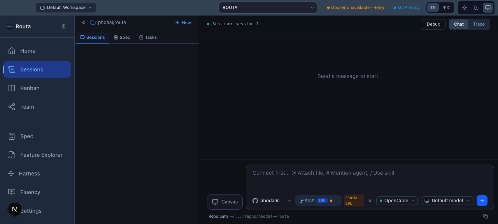
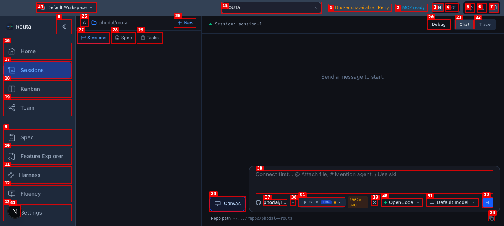

# Dogfood Report: Routa Live Canvas Entry

| Field | Value |
|-------|-------|
| **Date** | 2026-04-27 |
| **App URL** | http://localhost:3000/workspace/default/sessions/session-1 |
| **Session** | routa-live-canvas-qa |
| **Scope** | Live session Canvas entry and first-run UX |

## Summary

| Severity | Count |
|----------|-------|
| Critical | 0 |
| High | 0 |
| Medium | 1 |
| Low | 0 |
| **Total** | **1** |

## Issues

### ISSUE-001: Canvas entry gives no usable next step when chat is disconnected

| Field | Value |
|-------|-------|
| **Severity** | medium |
| **Category** | ux |
| **URL** | http://localhost:3000/workspace/default/sessions/session-1 |
| **Repro Video** | videos/canvas-entry-repro.webm |

**Description**

The `Use Canvas` action is visible and clickable even when the chat composer is not connected. Clicking it changes the button label to `Canvas`, but the composer remains empty and only shows the disabled `Connect first...` placeholder. There is no toast, inline message, disabled state, or guidance explaining that the Canvas prompt could not be inserted or what the user should do next.

Expected behavior: either the Canvas entry should be disabled until the composer can accept the generated prompt, or the click should surface actionable guidance such as selecting/connecting a provider before starting Canvas mode.

**Repro Steps**

1. Navigate to the session page.
   

2. Click `Use Canvas`.
   

3. **Observe:** the action changes to `Canvas`, but the composer remains empty with `Connect first...`; no Canvas prompt or feedback is shown.
   

**Additional Evidence**

- Initial annotated screenshot: `screenshots/initial-session.png`
- Console/errors were checked after reproduction. No runtime errors were reported; only React DevTools and HMR logs appeared.
