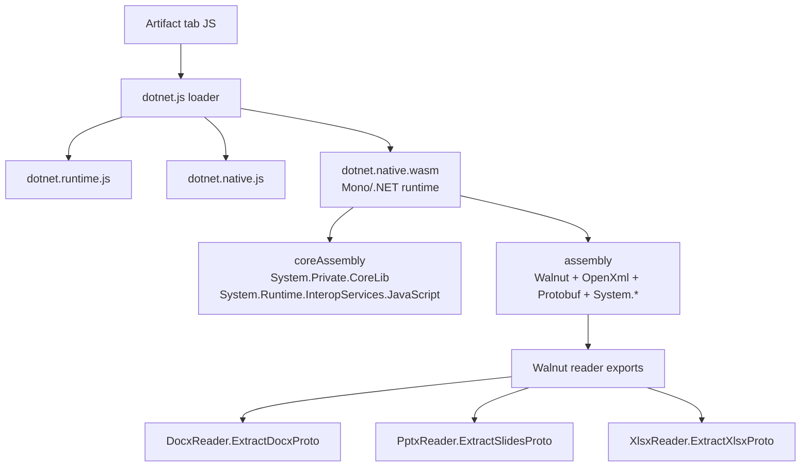

# Office Document Viewer WASM Reader Reference

This directory is the reference implementation workspace for turning the current Office WASM proof-of-concept into a Routa-owned artifact viewer.

It intentionally does not vendor the extracted Codex `Walnut` assets. Those files live under `tmp/codex-app-analysis/extracted/webview/assets` for local analysis only. Production code should either use a Routa-owned reader implementation or an approved third-party dependency path.

## Current POC

The working local proof-of-concept is:

- `src/app/debug/office-wasm-poc/page-client.tsx`
- `src/app/debug/office-wasm-poc/office-wasm-config.ts`
- `src/app/api/debug/office-wasm-poc/assets/[...slug]/route.ts`
- `scripts/debug/check-office-wasm-poc-consistency.ts`

The debug route validates the core reader path:

```text
file input
  -> kind detection: csv / tsv / docx / pptx / xlsx
  -> CSV/TSV JS parser or Walnut .NET reader
  -> Document / Presentation / Workbook proto wrapper
  -> lightweight visual preview + raw JSON
```

## Bundle Relationship

The extracted Codex bundle uses a .NET browser-wasm runtime plus WebCIL assemblies:



At the WASM module level:

- `dotnet.native.wfd2lrj4w6.wasm` is the runtime module.
- `Walnut.nvqhqmqbjk.wasm`, `DocumentFormat.OpenXml*.wasm`, `Google.Protobuf*.wasm`, and `System.*.wasm` are WebCIL assembly containers.
- WebCIL modules expose payload accessors; the runtime loads them through the boot manifest instead of through direct WASM imports.

## Production Shape To Aim For

The first Routa-owned implementation has been started under:

```text
tools/office-wasm-reader/
  Directory.Packages.props
  DEPENDENCIES.md
  Routa.OfficeWasmReader/
```

It uses the same dependency family as the extracted bundle: .NET browser-wasm `9.0.14`, `DocumentFormat.OpenXml` / `DocumentFormat.OpenXml.Framework` `3.3.0`, `System.IO.Packaging` `8.0.1`, and `Google.Protobuf` `3.31.0`.

Start by extracting reusable code from the debug POC into a product-facing module boundary:

```text
src/client/office-document-viewer/
  artifact-kind.ts
  office-artifact-types.ts
  readers/
    office-artifact-reader.ts
    csv-reader.ts
    wasm-office-reader.ts
    reader-cache.ts
  protocol/
    office-artifact-types.ts
    office-artifact-protobuf.ts
    routa-office-wasm-reader.ts
  components/
    OfficeArtifactPreview.tsx
    DocumentPreview.tsx
    PresentationPreview.tsx
    WorkbookPreview.tsx
  __tests__/
    artifact-kind.test.ts
    reader-cache.test.ts
```

Only add a non-debug asset route if the reader assets are approved for shipping:

```text
src/app/api/office-document-viewer/assets/[...slug]/route.ts
```

Desktop and web UI should call this through `resolveApiPath` and `desktopAwareFetch` where a fetch boundary is needed.

## Reader Boundary

Keep the reader ABI narrow and replaceable:

```ts
export type OfficeArtifactKind = "csv" | "tsv" | "docx" | "pptx" | "xlsx";

export type ParsedOfficeArtifact =
  | { kind: "document"; sourceKind: "docx"; proto: unknown }
  | { kind: "presentation"; sourceKind: "pptx"; proto: unknown }
  | { kind: "spreadsheet"; sourceKind: "csv" | "tsv" | "xlsx"; proto: unknown };

export interface OfficeArtifactReader {
  parse(bytes: Uint8Array, kind: OfficeArtifactKind): Promise<ParsedOfficeArtifact>;
}
```

This keeps the UI independent from the first reader implementation. A JS-only reader, a Routa-owned .NET reader, or a server-backed reader can all implement the same contract.

## Migration Steps

1. Move file-kind detection and parse result types out of `page-client.tsx`.
2. Move CSV/TSV parsing into `readers/csv-reader.ts`.
3. Wrap the current Walnut loader behind `OfficeArtifactReader` for debug-only validation.
4. Extract preview components from the POC into reusable components with i18n-only labels.
5. Connect the reader to session canvas or artifact tabs behind a feature flag.
6. Decide whether the shipped route uses JS libraries, a Routa-owned WASM reader, or server-side parsing.

## Product Constraints

- Do not ship extracted Codex `Walnut` binaries as Routa product assets without a licensing decision.
- Keep Office preview assets lazy-loaded; the extracted bundle is around 10-12 MB.
- Keep parsing off the main rendering path where possible; large DOCX/PPTX/XLSX files should show progress and have a size limit.
- Prefer a stable intermediate artifact model if future editing, diffing, or export-back-to-Office is in scope.

## Primary Record

The active analysis and evidence live in:

- `docs/issues/2026-05-01-office-document-viewer-wasm-reader.md`
